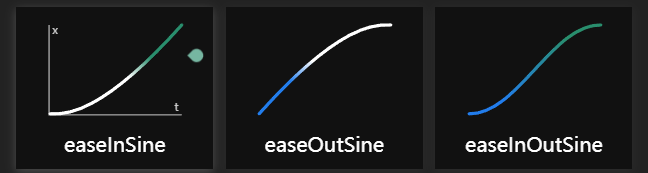

# UI缓动动画

Tween 一般指游戏开发中UI的缓动动画。因为 DoTween 和 XXTween等库的流行，我认为，对于开发者，使用Tween比起“缓动动画”更能表达意思。

如果一个按钮的位置从A点到B点，又或是缩放率从a倍到b倍，使用线性过渡总会显得动画很僵硬（因为现实中物体的运动往往不是匀速），所以便有了这一章：介绍常用的Tween动画过渡方式。

## 常用Tween一览

这个[缓动函数一览](https://easings.net/zh-cn)中，有常用的缓动函数图，点击还可以得到他的**过渡效果**和**数学函数**。

## 如果x不是时间，y也不是距离？

一般的缓动函数，y = f(x)，x代表时间，y代表距离。但如果不是这种情况呢？例如，y是速度，x是距离，该如何考虑？

1. 可以求反函数和一阶导数，根据原公式建立新的公式，但这样稍微有点复杂了。
2. 取几个距离的期望速度，在需要的时候取插值

*但在做滚动列表时，若想通过滚轴位置变化来推出**速度**变更，则需要考虑Update函数离散计算可能导致的问题。感觉这样做反而更复杂，不如通过状态判断出滑动状态，使用Tween做**坐标**上的过渡动画好一点。

## 什么时候用那种tween?

WIP

## 参考
- [头图 - 咖喱味LeanTween教程 Youtube](https://www.youtube.com/watch?app=desktop&v=K_bJvKXjCmU)
- [缓动函数一览](https://easings.net/zh-cn)
    - [开源仓库](https://github.com/ai/easings.net)