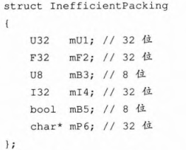
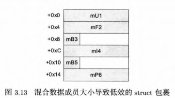
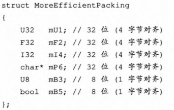
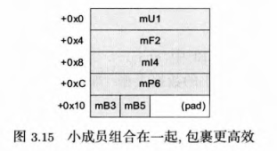
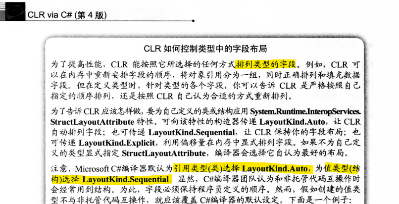
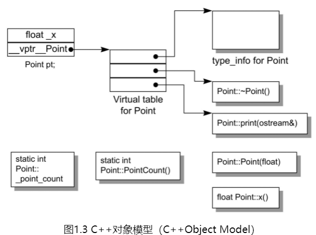

# 类型

流行的编程语言基本都支持OOP（Object Oriented Programming, 面向对象编程），而类型是OOP的基石。类型具有封装、多态和继承特性。

在类型中，往往需要考虑以下问题：
- 类型中的数据，如何排布在内存中
    - C++和C#的策略并不相同
- （类型的）实例如何传递给函数，其数据成员如何共享
- 类型如何利用虚函数实现（运行时）多态
- 访问控制（封装）
- 类型转换规则（如：int->long，derive->base）

## 类型内存安排

为了加速内存的读取（可能和内存读写的最小单位有关），类型中的数据往往会被施以内存对齐策略。[《游戏引擎架构 第2版》](https://book.douban.com/subject/34864920/)中，就给出了C++中的一种默认对齐策略：

<center>  </center>

针对这种对齐策略，可以进一步修改类成员的顺序，减少内存开销：

<center>  </center>

左边为类型详情，右边为在内存中的排布。这种策略是按照字节大小的倍数（4字节（32位）对齐4字节，1字节（8位）对齐1字节）对齐。C++中提供一些方法可以配置对齐的粒度。

:::details C++配置对齐粒度

方法一：使用 `#pragma pack`

```cpp
#pragma pack(push, 1) // 设置字节对齐为 1 字节，取消自动对齐
struct UnalignedStruct {
    char a;
    int b;
    short c;
};
#pragma pack(pop) // 恢复默认的字节对齐设置
```

方法二：使用`alignas` ( `alignof` 查询)

```cpp
struct alignas(16) AlignedStruct {
    int i;
};

int main() {
    AlignedStruct a;
    std::cout << "Alignment of AlignedStruct: " << alignof(a) << std::endl;
    return 0;
}
```
:::

而对于**C#**，由于堆内存已经被托管，且指针被设为 `unsafe`，除了对齐策略外，还有再排序策略（对class默认启用该策略，对struct默认不启用该策略）。[《CLR via C# 第四版》](https://book.douban.com/subject/26285940)第110页已经给出了详尽的解释：



## 特殊的成员函数和对象拷贝

### 构造函数和析构函数

> "我立即添加了构造函数和析构函数。它们当时非常新颖，但从我的计算机架构和操作系统背景来看，我认为它们也不算很新奇，因为我需要一个机制来建立一个工作环境（构造函数）和一个逆操作来释放运行期获得的资源（析构函数）" —— [《HOPL4 C++》，Bjarne Stroustrup](https://github.com/Cpp-Club/Cxx_HOPL4_zh/tree/main)

C++提出了RAII（Resource Acquisition ls Initialization，资源获取即初始化）这一理念来定义构造函数应该做的事情，以便在对象离开作用域后能正确的释放资源。

注意：
- 构造函数会从基类开始执行
- （C++）当存在虚函数时，析构函数也应该是虚函数

### 成员的初始化

C++的成员初始化发生在构造函数的 `初始化列表` 中，并且按照变量的**声明顺序**构造，也可以内联构造，如以下代码所示：
> “内联构造”准确的说应该是：默认成员初始化器——给数据成员一个默认值，这个默认值可以被构造函数中的初始化所取代

```cpp
class TestClassB{
public:
    // TestClass是一个构造函数中带cout的类，用于调试这种东西
    TestClass tc1 = TestClass(0); // 内联初始化
    TestClass tc2 = TestClass(3);
    TestClassB(): tc1(2) // 覆盖了tc1的内联初始化，应该在编译时就优化掉了
    {
    }
};
```

C#中class的成员初始化发生在构造函数的 `函数体` 中，也可以内联构造（和C++的覆盖规则不同），如以下代码所示：

```csharp
class TestClassB
{
    int a;
    TestClass b = new TestClass(0); // 先执行
    public TestClassB() // 这里只能写 `:base(xxx)` 看来C#的开发人员不是很喜欢C++的初始化列表
    {
        a = 10;
        b = new TestClass(1); // 后执行
    }
}
```

对于C#中的struct，成员初始化不可以内联构造，且在构造函数中必须为所有成员初始化。一个声明了却没有初始化的struct，其值置为“零”或null。
> "值类型（struct）构造器的工作方式与引用类型（class）的构造器截然不同。CLR总是允许创建值类型的实例，并且没有办法阻止值类型的实例化。" - [《CLR via C# 第四版》](https://book.douban.com/subject/26285940) 8.2章

在C#中如果在class中定义一个struct，并且不做任何显式初始化，他就会被初始为全“零”，但**不会**调用无参构造函数，这一点和C++有很大的区别。

特别的，对于**静态成员变量**。C++在全局作用域中初始它们，C#则在“类型对象”的实例化时初始它们。

### 拷贝-C++：复杂的拷贝控制函数

C++的拷贝控制函数有哪些呢？
- 拷贝构造函数
- 拷贝赋值函数
- 移动拷贝构造函数
- 移动拷贝赋值函数
- 析构函数

可以看出C++的拷贝控制是相当复杂的，有5个可用于拷贝控制的函数。其中“移动”开头的函数需要结合“移动语义”去理解。在实现类的时候一般需要遵循“三五原则”，即考虑移动语义，实现五个，不考虑移动语义，则实现三个。

::: details 简单的测试类

以下代码展示了一个简单的拷贝控制测试类

```cpp
class TestClass{
public:
    TestClass(){ // 构造函数
        cout << "ctor call" << endl;
    }
    TestClass(const TestClass& foo){ // 拷贝构造函数
        cout << "copy call" << endl;
    };
    TestClass(TestClass&& foo) noexcept{ // 移动拷贝构造函数
        cout << "move copy call" << endl;
    };
    TestClass& operator=(const TestClass& foo){ // 拷贝赋值函数
        cout << "assign call" << endl;
        return *this;
    }
    TestClass& operator=(TestClass&& foo) noexcept{ // 移动拷贝赋值函数
        cout << "move assign call" << endl;
        return *this;
    }
    ~TestClass(){ // 析构函数
        cout << "finalize call" << endl;
    }
};
``` 
:::

在拷贝控制函数中，主要关注“像值的类”和“像指针的类”的处理。在[《C++ Primer 第五版》](https://book.douban.com/subject/10505113/)第13章拷贝控制中，已给出详尽的解释。进一步，可以结合容器类的设计去理解这一过程。

除此之外，还需注意：
- 隐式转换的影响和explict
    - 如 `Myclass a = 5;` 可能是 `Myclass` 类有类似 `Myclass(int a)` 的构造函数，int字面量 `5` 先被隐式转换成了 `Myclass`。可以改成 `explicit Myclass(int a)` 避免隐式转换。

### 拷贝-C#：Class和Struct的区别

WIP

## 虚函数的管理方法

为了实现运行时多态，运行中需要知道对象准确的类型。

### C++：虚表和RTTI
C++使用虚表解决运行时访问虚函数的问题（有虚函数的类才有虚表），用户也可以通过RTTI（Runtime Type Identification，执行期类型识别）获取对象的真实类型。

其中虚表地址在对象指针指向第一个的位置。在[C++ 虚函数表 - 编程指北](https://csguide.cn/cpp/object_oriented/virtual_function.html#c-%E5%AF%B9%E8%B1%A1%E6%A8%A1%E5%9E%8B)中，按地址访问了这些虚函数。

:::details 《深度探索C++对象模型》所示的虚表
下列代码定义了一个类

```cpp
class Point{
public:
	Point(float xval); 
	virtual ~Point();
	float x() const,
	static int PointCount();
protected:
	virtual ostream& print(ostream &os) const;
	float _x;
	static int _point_count;
};
```

它对应的模型：



:::

除此之外，还需注意：
- C++的多继承和菱形继承问题
- 若想通过虚表访问虚函数（动态绑定），必须是从有继承关系的对象指针或引用调用虚函数。
    - 总之编译器会检查，不会把不需要动态绑定的调用编译成访问虚表的版本

### C#：类型对象

WIP

### 抽象类和接口

WIP

## 访问控制

这个话题由于牵扯到工程问题，会比较复杂。先以关键字为出发的简单涉及一下：

- 成员的private, public, protected
- C++继承时还分public继承、private继承和protected继承。
- C#由于全都是类，则类的private, public, protected用来限制访问域
    - 还有internal，sealed，static，abstract，partial关键字

C++的b友元是谁想出来的？

## 类型转换

### C++：static_cast、reinterpret_cast、const_cast 和 dynamic_cast

这些类型转换函数消除了 C 风格的类型转换 `()` 中的二义性，其中：
- `static_cast` 用于非多态类型的转换，一般用于转换数值数据类型，最好不要于指针的转换。
    - *对于值转换，会调用含转换前值的新类型的构造函数
- `dynamic_cast` 用于**多态**类型的转换，只适用于指针或引用，执行运行时类型检查
    - 很像C#和Java编程语言中的类型转换
    - 相当安全，但检测也会消耗时间
- `const_cast` 用于删除 const、volatile 和 __unaligned 特性。
- `reinterpret_cast` 用于位的简单重新解释，没事不要用这个。

*`static_cast`的值转换：
```cpp
class TestClassA{};
class TestClassB{
public:
    explicit TestClassB(int a){}
};
int main(){
     int b = 10;
     auto b1 = static_cast<TestClassA>(b); // 编译失败
     auto b2 = static_cast<TestClassB>(b); // OK，因为存在这样的构造函数
}
```


### C#：is、as和类型安全

C#也支持 C 风格的类型转换 `()`

WIP

## 参考
- [《游戏引擎架构 第2版》](https://book.douban.com/subject/34864920/)
    - 3.2.5.1 C/C++的数据、代码和内存/对齐和包裹
- [C++字节对齐 - 编程指北](https://csguide.cn/cpp/basics/byte_alignment.html#%E5%AD%97%E8%8A%82%E5%AF%B9%E9%BD%90%E8%A7%84%E5%88%99)
- [《CLR via C# 第四版》](https://book.douban.com/subject/26285940)
    - 5.2 引用类型和值类型
    - 8.2 实例构造器和结构（值类型）
- [《HOPL4 C++》，Bjarne Stroustrup](https://github.com/Cpp-Club/Cxx_HOPL4_zh/tree/main)
- [《C++ Primer 第五版》](https://book.douban.com/subject/10505113/)
- [C++ 虚函数表 - 编程指北](https://csguide.cn/cpp/object_oriented/virtual_function.html#c-%E5%AF%B9%E8%B1%A1%E6%A8%A1%E5%9E%8B)
- [强制类型转换运算符的说明 - C++面试问题，作者：huihui，github](https://github.com/huihut/interview/blob/master/README.md#%E5%BC%BA%E5%88%B6%E7%B1%BB%E5%9E%8B%E8%BD%AC%E6%8D%A2%E8%BF%90%E7%AE%97%E7%AC%A6)
- 拓展（好像是设计思想）：[《深度探索C++对象模型》[美] Stanley B. Lippman，侯捷译](https://book.douban.com/subject/10427315/)
