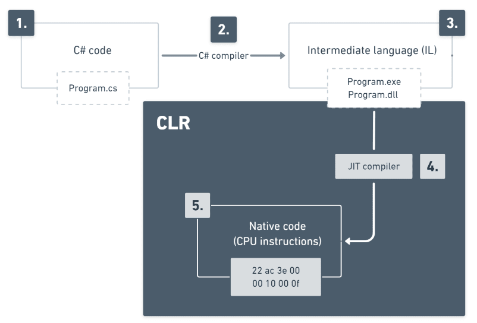
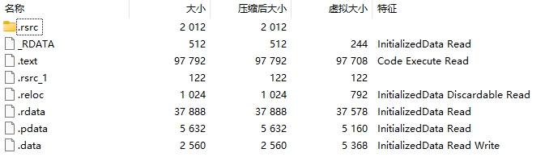

# 编译产物及JIT（C#）

C#程序的编译过程如下图所示：

一个C#项目编译后的可执行文件的结构（以压缩文件打开）如下图所示：

编译产物是 ECMA-335 程序集（.dll），或可执行程序（.exe）。这里主要讨论程序集的情况。
- 可执行程序的情况比较复杂，可以是AOT的机器码，也可以打包出程序集的启动代理，取决于编译时的配置。

### metadata

相比c++ RTTI只对检测到多态特性的类生成`type_info`，C#对所有类生成完整元数据。

WIP

### 编译的中间语言IL

WIP

### 什么时候JIT

WIP

## 针对C#特性的特殊处理

WIP

## 查看编译过程的IL代码

WIP

## 参考
- [《CLR via C# 第四版》](https://book.douban.com/subject/26285940)
- [.NET compilation process explained (C#) - dev.to 2021](https://dev.to/kcrnac/net-execution-process-explained-c-1b7a)
    - 第一章编译的流程图就来自这里
- [The Book of the Runtime](https://github.com/dotnet/runtime/tree/main/docs/design/coreclr/botr)