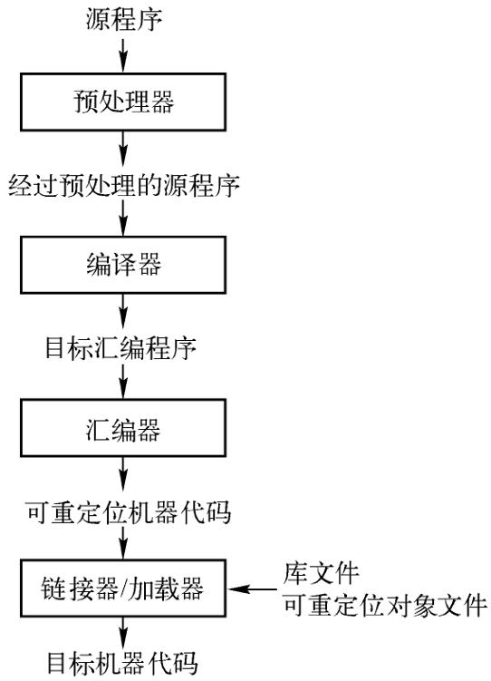
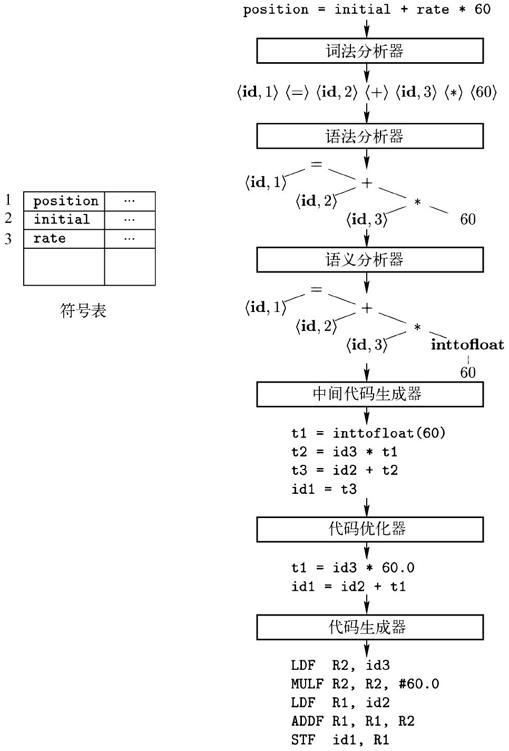
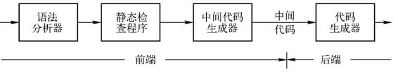

# 编译

编译指通过编译器转化代码的过程，具体而言：将某种编程语言写成的源代码（原始语言）转换成另一种编程语言（目标语言）。编译器在一个语言处理系统的位置如下图所示【2】。
> C++的编译器将C++代码转化为汇编代码（一般在流程中直接进一步转化为机器码），C#的编译器（Roslyn）将C#代码转化为IL代码（C#编译要拆成AOT部分和JIT部分，这里指的是AOT部分）

它主要的目的是将便于人编写、阅读、维护的高级计算机语言所写作的源代码程序，翻译为计算机能解读、运行的低阶机器语言的程序，也就是可执行文件。【1】

本文将简单介绍编译流程中的内容，并对[C++](./CompileCpp.md)、[C#](./CompileCsharp.md)**编译生成的产物**进一步分析。
> 对于C#，关注IL代码（编译生成的产物）相比学习编译知识，在理解运行时性能问题方面性价比更高。

## 将编译按步骤进行分类

在编译原理的大部头中，编译可以分为：词法分析、语法分析、语义分析、中间代码生成（可能）、代码优化（可选）、代码生成这几个步骤【2】

如果要将这些步骤再分个类，那么：
- **预处理**也在编译流程中，但一般不提及，因为比较简单（只是文本过滤与替换）。
- **词法分析、语法分析、语义分析、中间代码生成**是编译中的分析部分，往往被称为前端（Front End）
    - 这部分涉及大量算法，其思想可以复用于文本文件（如日志和代码安全性分析等）的分析。
    - C#的编辑器（Roslyn）某种程度属于前端，生成了中间代码（IL）就停下了
- **代码优化、代码生成**往往被称为后端（Back End）
    - 代码生成器有三个主要任务：指令选择、寄存器分配和指派、以及指令排序。
    - c++的虚表、存储布局分配（.data 和 .bss 段）也在代码生成时完成
    - C#的JIT某种程度属于后端

## 代码分析-前端（Front End）

由于分析阶段不同语言所用技术较为晦涩、且相似度很高，主要是我目前也不是很理解（大量涉及我最“喜欢”的树和图），所以暂时SKIP

### 更多代码分析

其中各种各样的语言feature和语法糖在这一步被处理为中间代码，如：
- c++的lambda转换为函数对象【3】
- c#为枚举器生成状态机
- c++的RTTI支持，要在分析阶段识别“多态需求”

*这部分属于工业实践，在《编译原理》书中不涉及

## 代码优化

WIP

## 对比分析编译产物

这里举例三种不同语言的编译产物做进一步理解，分别是：c++(编译型)、c#(编译型+JIT)、python(解释型)。

| 语言 | 编译产物 | 执行者 | 什么时候翻译成机器码？ |
| :--- | :--- | :--- | :--- |
| **C++** | 汇编/机器码 | 物理 CPU | 运行前（静态编译 AOT） |
| **C#** | IL 代码 | .NET 虚拟机 (CLR) | 运行时（通过 JIT 翻译成机器码） |
| **Python** | 字节码 (Bytecode) | Python 虚拟机 (PVM) | 不翻译成机器码（通常是模拟执行，除非用 PyPy） |

::: tip 相关概念 
- AOT(Ahead-of-time, 提前编译)
    - 区别于"完全静态编译（Full-ahead-of-time,Full-AOT）:程序运行前，将所有源码编译成目标平台的原生码。" // 感觉怪怪的
    - Unity文档是这样描述的："Ahead of Time (AOT) compilation is an optimization method used by all platforms except iOS for optimizing the size of the built player."
    - 程序运行之前，将.exe或.dll文件中的CIL的byte code部分转译为目标平台的原生码并且存储，程序运行中仍有部分CIL的byte code需要JIT编译。
- JIT(Just-in-time, 即时编译)
    - 程序运行过程中，将CIL的byte code转译为目标平台的原生码。
    - 具体在C#中，执行函数前会加载函数需要的程序集，并在执行方法时编译方法的IL代码，一个方法反复执行在同一个AppDomain中时，只用编译一遍。
- Interpreter(解释器)
    - 参考Python等解释语言，由于每一段逻辑都要运行时编译，会显著影响效率。
:::

## 工程问题

1. 包管理
    > c++的编译看起来十分复杂，编译出程序首先要解决依赖问题，不能通过一个gcc指令就编译，通常要写复杂的makefile。而c#则不同。简单项目通过visual studio的build指令，就可以直接生成带完整dll依赖的可执行文件。
2. IL2cpp
    - 将IL代码转换成 C++ 代码，再编译成目标平台的机器码。

## 参考
1. [Compiler - wikipedia](https://en.wikipedia.org/wiki/Compiler)
    - 维基百科会把编译（compile）词条重定向到编译器（compiler）
2. [编译原理 - 第二版](https://book.douban.com/subject/3296317/)
3. [《C++ Primer 第五版》](https://book.douban.com/subject/10505113/)
    - 14.8.1 lambda是函数对象
    - 19.2 运行时类型识别