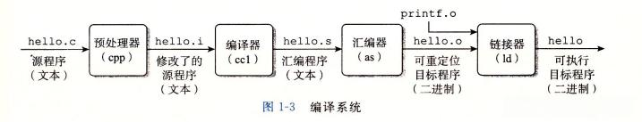

# 编译（C++）

## 编译流程介绍



### 特殊语法的编译流程

## 查看编译过程的汇编代码

对于c++语言，有两种选择，一种是查看 `.s` 文件，一种是对 `.exe` 文件执行 `objdump -d` 指令。

现在有如下代码，将通过两种方式观察其汇编代码。

```cpp
//#include <bits/stdc++.h>
#include <iostream>
using namespace std;

int main(){
    string str = "hello world!";
    cout << str << endl;
}
```

#### **通过 `.s` 文件**

执行命令行: `g++ -S -fverbose-asm main.cpp` 获取 `main.cpp` 编译过程中的汇编代码。

> `-fverbose-asm` 是一个可选选项，它会在汇编输出中包含额外的注释

截取其中一部分代码：

```
 # c:\programdata\chocolatey\lib\mingw\tools\install\mingw64\include\c++\12.2.0\bits\basic_string.tcc:241: 	} __guard(this);
	movq	16(%rbp), %rdx	 # this, tmp98
	leaq	-24(%rbp), %rax	 #, tmp99
	movq	%rax, %rcx	 # tmp99,
	call	_ZZNSt7__cxx1112basic_stringIcSt11char_traitsIcESaIcEE12_M_constructIPKcEEvT_S8_St20forward_iterator_tagEN6_GuardC1EPS4_	 #
 # c:\programdata\chocolatey\lib\mingw\tools\install\mingw64\include\c++\12.2.0\bits\basic_string.tcc:243: 	this->_S_copy_chars(_M_data(), __beg, __end);
	movq	16(%rbp), %rax	 # this, tmp100
	movq	%rax, %rcx	 # tmp100,
	call	_ZNKSt7__cxx1112basic_stringIcSt11char_traitsIcESaIcEE7_M_dataEv	 #
	movq	%rax, %rcx	 #, _6
```

结合注释看这段代码，好像是在描述`string str = "hello world!";`的拷贝过程。


#### **通过 `.exe` 文件**

执行命令行: `objdump -d test.exe > disassembly.txt` 获取 `.exe` 中机器码对应的反汇编代码

> 一般代码块（机器码）在 `.exe` 文件中的 `.text` 段中，可以以压缩文件的方式打开`.exe` 文件中的 `.text`文件查看，也可以执行命令行 `objdump -s --section=.text test.exe > text_section.txt` 。

它的 `<main>` 代码块如下：

```
00000001400015e0 <main>:
   1400015e0:	55                   	push   %rbp
   1400015e1:	53                   	push   %rbx
   1400015e2:	48 83 ec 58          	sub    $0x58,%rsp
   1400015e6:	48 8d 6c 24 50       	lea    0x50(%rsp),%rbp
   1400015eb:	e8 07 02 00 00       	call   1400017f7 <__main>
   1400015f0:	48 8d 45 f7          	lea    -0x9(%rbp),%rax
   1400015f4:	48 89 45 f8          	mov    %rax,-0x8(%rbp)
   1400015f8:	90                   	nop
   1400015f9:	90                   	nop
   1400015fa:	48 8d 55 f7          	lea    -0x9(%rbp),%rdx
   1400015fe:	48 8d 45 d0          	lea    -0x30(%rbp),%rax
   140001602:	49 89 d0             	mov    %rdx,%r8
   140001605:	48 8d 15 f4 39 00 00 	lea    0x39f4(%rip),%rdx        # 140005000 <.rdata>
   14000160c:	48 89 c1             	mov    %rax,%rcx
   14000160f:	e8 3c 1b 00 00       	call   140003150 <_ZNSt7__cxx1112basic_stringIcSt11char_traitsIcESaIcEEC1IS3_EEPKcRKS3_>
   140001614:	48 8d 45 f7          	lea    -0x9(%rbp),%rax
   140001618:	48 89 c1             	mov    %rax,%rcx
   # 后面太多了，省略...
```

简单看一下，如果不是其中的 `stringIcSt11char` 我根本看不出来它和我的程序有什么关系..

## 参考
- [cpp separate complilation - hackingcpp](https://hackingcpp.com/cpp/lang/separate_compilation.html)
- [2015 CMU 15-213 CSAPP 深入理解计算机系统 课程视频 - Bilibili](https://www.bilibili.com/video/BV1iW411d7hd?p=5&vd_source=23f1f06b4fe8584d2ba54d7e6a5dd238)
    - P5-P9