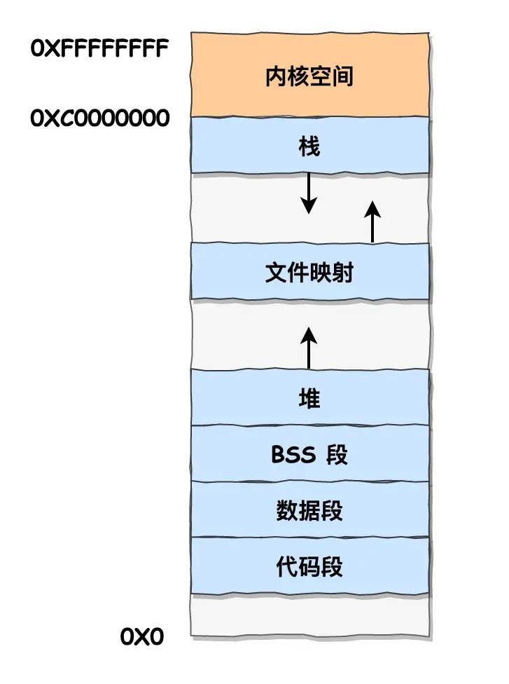

# 内存管理

## 操作系统的内存安排

在[图解系统](https://www.xiaolincoding.com/os/3_memory/malloc.html#linux-%E8%BF%9B%E7%A8%8B%E7%9A%84%E5%86%85%E5%AD%98%E5%88%86%E5%B8%83%E9%95%BF%E4%BB%80%E4%B9%88%E6%A0%B7)中，描述了32位linux系统中进程内存的安排，如下图所示：

其中内核空间为共享空间，占1个G。其他为用户空间，进程之间相互独立，占3个G。地址均为虚拟地址。（不然一个程序就把内存占满啦）

内存管理需要关注的，是栈和堆的部分，它们是程序运行过程中变动最频繁的两个区域。

## C++：堆和new

使用new创建的对象，分配的内存空间被称为“自由存储区”，因为new操作符可以被重载，内存不一定分配到堆上。在文章《[重载new/delete，在静态存储区、栈上分配空间 - 用户“-出发-”，CSDN](https://blog.csdn.net/happyjacob/article/details/104766843)》 中，就介绍了重载全局new运算符，变更分配内存位置的方法。

当然一般情况下在C++中都使用 `new` 操作符为对象在堆中分配内存，分配时会调用 `malloc` 函数。

在销毁内存时则使用 `delete` 操作符，它同样可以被重载，一般是在里面调用 `free` 函数释放分配给对象的内存。

特别的：
- 对于数组对象，在删除时记得使用 `delete[]` 告诉编译器需要删除的对象是一个数组。
- 若想在已经分配的内存中直接初始化（而非通过new临时量再赋值的方式），可以使用 定位new，配合 `operator new` 分配空间（ 后面推出了 `allocator` stl类，标准化了 `operator new` 、`operator delete` 和 定位new 的作用）。
    > `operator new` 是一种全局 `new`，区别于成员函数 `new`。作用类似 `malloc` ，在分配内存时不调用对象的构造函数。例： `int* arr = (int*)operator new(size * sizeof(int))`

### stl提供的管理方式

`shared_ptr<T>`, `vector<T>`, `allocator<T>` 是我目前已知用于辅助管理内存的类。

`shared_ptr<T>` 用于辅助程序员回收不被引用的堆对象。使用引用计数，为了避免循环引用，提供了 `weak_ptr<T>` 和 `unique_ptr<T>` 两种类分情况管理，把循环引用的避免交给了程序员。这些结构在一起被称为“智能指针”，由于弱引用需要查询对象是否被删除，故智能指针的引用计数由专门的控制结构体管理。

`allocator<T>` 通常用于分配数组的空间，目的是分离内存分配和对象构造（因为使用new创建对象时，会执行new操作符为对象分配内存，接着执行对象的构造函数）。

`vector<T>` 是stl提供的动态数组容器，管理了堆上的对象（当然还有其他各种容器如 `list<T>`、`set<T>` 等，但`array<T,size>`是分配在栈上的，和作为复合类型的内置数组一样）。
> 如何证明这一点，除了直接看元素的虚拟地址之外，还可以分配一个 “size乘对象” 大小超过栈上限的数组，若出现栈溢出，则。。

> TODO：左值右值也可以看作一种辅助内存管理的特性，这一点应该补充一下

## C#：托管堆和GC

WIP

还有unsafe指针和fix

## 变量初始化顺序和位置

### C++中

| 变量类型      | 初始化顺序（时间） | 初始化位置  | 默认初始化是值初始化吗？  | 
| -------------|-------------------| -----------| ----------------|   
| 局部变量   | -- | 栈 | 内置类型不做值初始化，自定义类型调用构造方法 |
| 全局变量   | 按定义顺序  | 静态数据段 | 是 |
| 静态（成员）变量   | 按定义顺序 | 静态数据段 | 是 |
| 静态局部变量   | 第一次执行到时 | 静态数据段 | 是 |
| 普通成员变量   | 从子类到父类，按定义顺序 | 跟随实例 | 是 |

> 静态成员变量 比较特殊，他在类中出现仅相当于是声明，还必须要在全局作用域定义后才可以使用。

### C#中

WIP

## 参考
- [图解系统，4.2 malloc 是如何分配内存的？#Linux 进程的内存分布长什么样？ - 小林coding](https://www.xiaolincoding.com/os/3_memory/malloc.html#linux-%E8%BF%9B%E7%A8%8B%E7%9A%84%E5%86%85%E5%AD%98%E5%88%86%E5%B8%83%E9%95%BF%E4%BB%80%E4%B9%88%E6%A0%B7)
- [《C++ Primer 第五版》](https://book.douban.com/subject/10505113/)
    - 12.2 动态数组
    - 19.1 控制内存分配（new、delete、定位new）