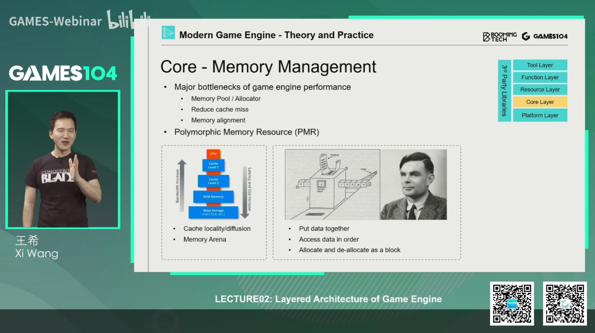
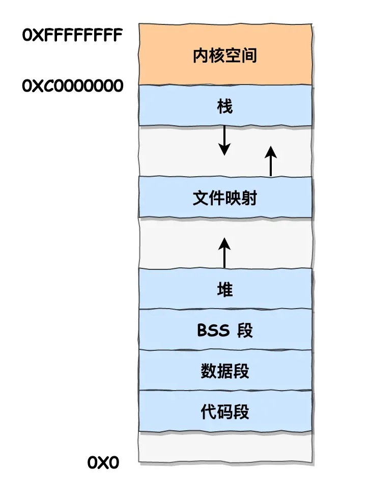

# 内存管理

内存管理是编程语言中最重要的部分之一，理解内存管理的细节和良好的编程习惯可以减少程序出现**内存泄漏**的可能。

## 游戏中内存管理的重要性



[02.引擎架构分层 | GAMES104 36:53](https://www.bilibili.com/video/BV12Z4y1B7th/?share_source=copy_web&vd_source=0adb7f42d815b5c9500f37460d0d6596&t=2213)

- 对于3A游戏，内存管理可能成为性能瓶颈。
    - 如cache未命中、短时间多次分配内存
- 对于低端平台（移动平台，WebGL）也是如此，只不过具体着重的点不同。
    - 如内存限制，卡IO

## 操作系统的内存安排

在[图解系统](https://www.xiaolincoding.com/os/3_memory/malloc.html#linux-%E8%BF%9B%E7%A8%8B%E7%9A%84%E5%86%85%E5%AD%98%E5%88%86%E5%B8%83%E9%95%BF%E4%BB%80%E4%B9%88%E6%A0%B7)中，描述了32位linux系统中进程内存的安排，如下图所示：



其中内核空间为共享空间，占1个G。其他为用户空间，进程之间相互独立，占3个G。地址均为虚拟地址。（不然一个程序就把内存占满啦）

内存管理需要关注的，是栈和堆的部分，它们是程序运行过程中变动最频繁的两个区域。

## C++：堆和new 

使用new创建的对象，分配的内存空间被称为“自由存储区”，因为new操作符可以被重载，内存不一定分配到堆上。在文章《[重载new/delete，在静态存储区、栈上分配空间 - 用户“-出发-”，CSDN](https://blog.csdn.net/happyjacob/article/details/104766843)》 中，就介绍了重载全局new运算符，变更分配内存位置的方法。

当然一般情况下在C++中都使用 `new` 操作符为对象在堆中分配内存，分配时会调用 `malloc` 函数。

在销毁内存时则使用 `delete` 操作符，它同样可以被重载，一般是在里面调用 `free` 函数释放分配给对象的内存。

::: tip 检验
下方代码中，`new` 和 `delete` 分别做了什么？
```cpp
class TestClass{};
auto t = new TestClass();
delete t;
```
可以参考[《C++ Primer 第五版》](https://book.douban.com/subject/10505113/)19.1节
:::

特别的：
- 对于数组对象，在删除时记得使用 `delete[]` 告诉编译器需要删除的对象是一个数组。
- 若想在已经分配的内存中直接初始化（而非通过new临时量再赋值的方式），可以使用 定位new，配合 `operator new` 分配空间（ 后面推出了 `allocator` stl类，标准化了 `operator new` 、`operator delete` 和 定位new 的作用）。
    > `operator new` 是一种全局 `new`，区别于成员函数 `new`。作用类似 `malloc` ，在分配内存时不调用对象的构造函数。例： `int* arr = (int*)operator new(size * sizeof(int))`

### stl提供的管理方式

`shared_ptr<T>`, `vector<T>`, `allocator<T>` 是我目前已知用于辅助管理内存的类。

`shared_ptr<T>` 用于辅助程序员回收不被引用的堆对象。使用引用计数，为了避免循环引用，提供了 `weak_ptr<T>` 和 `unique_ptr<T>` 两种类分情况管理，把循环引用的避免交给了程序员。这些结构在一起被称为“智能指针”，由于弱引用需要查询对象是否被删除，故智能指针的引用计数由专门的控制结构体管理。

`allocator<T>` 通常用于分配数组的空间，目的是分离内存分配和对象构造（因为使用new创建对象时，会执行new操作符为对象分配内存，接着执行对象的构造函数）。

`vector<T>` 是stl提供的动态数组容器，管理了堆上的对象（当然还有其他各种容器如 `list<T>`、`set<T>` 等，但`array<T,size>`是分配在栈上的，和作为复合类型的内置数组一样）。
> 如何证明这一点，除了直接看元素的虚拟地址之外，还可以分配一个 “size乘对象” 大小超过栈上限的数组，若出现栈溢出，则。。


### 其他管理内存的概念和特性

由类型支持的特性：左值右值、RAII（Resource Acquisition ls Initialization，资源获取即初始化）将在[类型](./Class)中讨论。

内存碎片：对于内存要求不严格的环境，操作系统的分页式内存管理就够用了，往往不需要在代码里特殊处理。
> "就算真的耗尽了内存，对于桌面应用与服务器应用来说，退出重新启动也很正常。服务器进程杀掉之后自动重启属于很常规的事。" —— [知乎回答，c++程序员如何处理内存碎片](https://www.zhihu.com/question/630126692)

## C#：托管堆和GC

为了减少程序员花在内存管理上的时间，一些编程语言引入了托管堆和GC，编程语言的运行环境可以回收不再被使用的内存。

### 线程栈和托管堆，struct和class

托管堆就是C#管理内存的地方，对象若无特殊情况，都创建在托管堆中。而线程栈是栈的“强调线程”版本，存储代码运行时的局部变量和PC。

struct和class本质上的区别是，实例化时：struct直接把数据放在赋予变量的地址上，而class则是放一个指针，指针指向托管堆中的数据。
> 和C++默认public private的简单分别不同。

这造成struct在传参、赋值时总是要拷贝完成的数据，而class只需拷贝指针就行，这给了struct相当特殊的语义和效果。
- struct代表着不应该被共用的数据，如int、float，如Unity的Vector3
- struct若是在线程栈上作为局部变量，可以跟着堆栈销毁，不必参加GC

### 空引用异常和指针

空引用异常是C#最常见的异常，往往是程序以非预期的顺序执行，访问了一个未初始化的变量。该异常往往因为没有报告出“具体是哪个字段为空”，需要仔细排查。

C#仍提供了使用指针的方式，用于做一些“访问速度快”的操作，需要以`unsafe`作为修饰。为了避免GC的内存压缩对指针可用性产生影响，还需使用`fix`作为修饰。

## 变量初始化顺序和位置

### C++中

| 变量类型      | 初始化顺序（时间） | 初始化位置  | 默认初始化是值初始化吗？  | 
| -------------|-------------------| -----------| ----------------|   
| 局部变量   | -- | 栈 | 内置类型不是，自定义类型是 |
| 全局变量   | 按定义顺序  | 静态数据段 | 是 |
| 静态（成员）变量   | 按定义顺序 | 静态数据段 | 是 |
| 静态局部变量   | 第一次执行到时 | 静态数据段 | 是 |
| 普通成员变量   | 从子类到父类，按定义顺序 | 跟随实例 | 是 |

> 对于自定义类型，值初始化会调用其构造函数。内置类型的值初始化会将其值置 “0”，局部变量的内置类型的默认值是未定义的，如 `int a` ，`a` 可能会是一串随机数。

> 静态成员变量 比较特殊，他在类中出现仅相当于是声明，还必须要在全局作用域定义后才可以使用。

### C#中

| 变量类型      | 初始化顺序（时间） | 初始化位置  | 初始值  | 
| -------------|-------------------| -----------| ----------------|   
| 局部变量struct   | -- | 线程栈 | 不为空，成员全取初始值 |
| 静态成员变量   | 随类型对象初始化，若有初始化器，按定义顺序 | 托管堆 | 取决于是struct或class |
| 普通成员变量   | 若有初始化器，按定义顺序 | 托管堆 | 取决于是struct或class |
| const成员变量(只能是有默认值的struct) | 编译到文件里 | -- | -- |

*注：常量表示出的字符串也会被编译进文件中

## 对象的判空

对于已被释放的对象，仍持有其地址的引用该如何判定该对象为空呢？

- 对于C++，若访问被释放的对象，将发生`未定义的行为`
- 对于C#，由于其“类型安全”和“垃圾回收”的特点，可以通过 `==null` 判空
    - 类型安全：永远可以判断对象的准确类型，对象的地址中存了“类型对象”
    - 垃圾回收：程序员不需主动释放，持有引用（并可以访问到）的对象不会被回收
    - *注意unsafe方法错误的改动数据可能导致奇怪的问题

## 未包含的部分

1. 因多线程影响而出现的特性

## 参考
- [图解系统，4.2 malloc 是如何分配内存的？#Linux 进程的内存分布长什么样？ - 小林coding](https://www.xiaolincoding.com/os/3_memory/malloc.html#linux-%E8%BF%9B%E7%A8%8B%E7%9A%84%E5%86%85%E5%AD%98%E5%88%86%E5%B8%83%E9%95%BF%E4%BB%80%E4%B9%88%E6%A0%B7)
- [《C++ Primer 第五版》](https://book.douban.com/subject/10505113/)
    - 12.2 动态数组
    - 19.1 控制内存分配（new、delete、定位new）