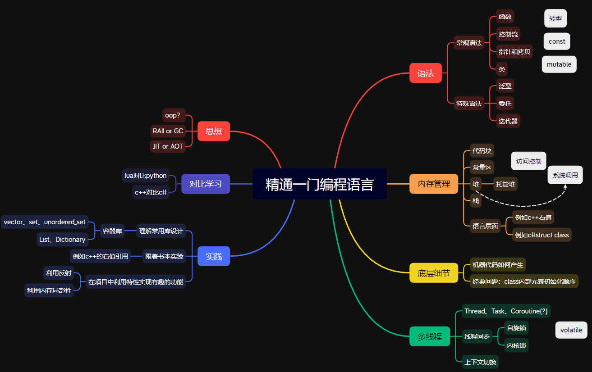

# 编程语言的学习方法

本版块将重点描述C#（7.0）和C++（11）两种编程语言的学习方法，参考部分也给出了一些书目。

## 背景故事

前几天面了某大厂的客户端开发，它的招聘需求里有这样一条：

> “至少了解一门C系语言，至少精通一门面向对象的编程语言，并深入了解其思想、原理和底层细节。” 
>  \*你甚至可以根据这句话搜到是哪个公司（ 

一面非常满足其中所写的，主要问对编程语言的熟悉程度（要求精通）。经历1小时的拷打后，我感觉这方面确实没有准备好，有些地方靠背八股文和只看书还是不太行，所以有了这个板块。

> 面试中我干了很蠢的事，面试官让我从c#和c++中挑一个问，我说都行，结果他选了c#。但实际我都没怎么看过c#的面经，对他问什么都没有一个预期。。居然把选择交给面试官，我很怀疑我当时的心理状态。

## 导图介绍

下图是一张我汇总的思维导图，我会在板块中的其他标题（子文章）中完善这些内容。

 如何精通一门编程语言-思维导图（看不清可以右键打开） 

**需要注意的是**：编程语言的实现细节是和操作系统、计算机组成原理等紧密相关的，可以举例抛出两个相关问题：
- 为什么多线程访问变量时需要使用volatile关键字？
    - 这里简单回答一下，除了保证操作的原子性和编译不打乱顺序外，还要保证访问变量时不从缓存的线程上下文（在CPU的Cache中）读取，而直接从内存读取。避免两个线程虽然访问的是同一个变量，但实际上都是访问各自在缓存中的副本的情况。
- 描述一次函数调用？

这里推荐阅读[图解系统系列](https://www.xiaolincoding.com/os)，如果想要更系统化的学习，那就去看相关的书和公开课吧。
> 基于观点“不经常用的东西就会忘”，我的想法是只仔细研究现在要用的部分，其余的细节简单看一下有个印象就好啦

## C++和C#的区别

- 从Unity角度上说：Unity使用C#作为脚本语言，其底层仍是C++。编译时有一种策略（IL2CPP）涉及C#到C++的转换。

- 从语言设计角度上说：
    - C#更“易用”。C#接管了内存管理内容（托管内存），并有一系列工程友好的“语法糖”。但“易用”并不意味学起来会更简单，反而会因为一些抽象的“语法糖”影响对代码本质的判断。
        > “C#语言设计者从C/C++规范中删除了他们不喜欢的特性，同时创建了他们喜欢的。开发组还有其他语言的资深专家。” —— 《Essential C# 7.0》
    - C#的可读性和鲁棒性更强。可读性强是由语法糖和托管内存（不像c++有各种指针和引用）提供的，鲁棒性则是C#的内置库发生访问越界问题都会抛出异常，转型也需要满足要求等，不像C++，可以通过指针访问和修改未经保护的内容，还有 `()` 转型和 `reinterpret_cast` 这种东西存在。
    - C#的JIT、IL、CLR，区别于C++的按平台编译，C#可以实现跨平台（即不同平台只需“编译”一次）。
    - ...
- 从内存管理角度上说：C++把内存管理交给了程序员，有`shared_ptr`之类的库去辅助执行。C#托管内存，但开发者需要注意垃圾回收（GC）的工作方式，以及可能由此产生的GC暂停，以及对“本机资源”（如`FileStream`）的特殊处理（“本机资源”这一点，c++也一样，需要通过构造析构完成申请和回收细节）。
- 从对OOP的支持角度上说：C++支持多继承，C#则通过接口近似多继承的功能。
- 从面试的角度上说：C++因为比较基础，有很多面经，在学习时可以根据面经检测是否学的牢固（指满足应聘方的要求）。而C#感觉可以问的角度很多，自己见的不多，不做评价（我畏惧了）。

## 参考
- [《C++ Primer 第五版》](https://book.douban.com/subject/10505113/)
- [cppreference.com](https://en.cppreference.com/w/cpp/language/basic_concepts)
- [《Essential C# 7.0》](https://book.douban.com/subject/33474759)
- [《CLR via C# 第四版》](https://book.douban.com/subject/26285940)
- [图解系统系列 - 小林coding](https://www.xiaolincoding.com/os)
