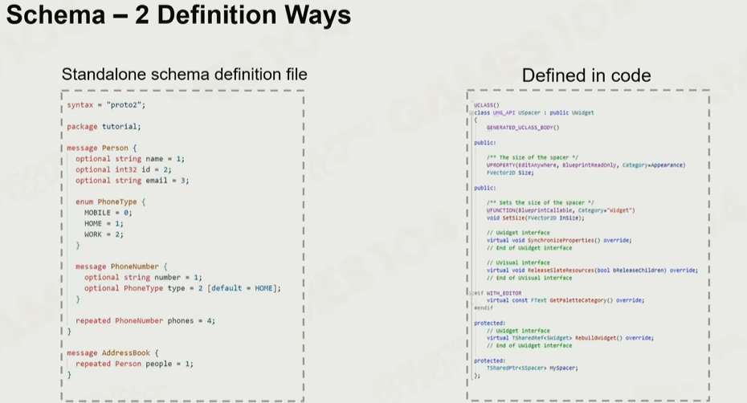
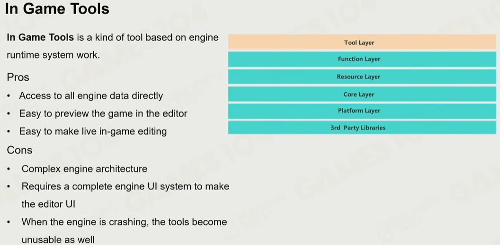
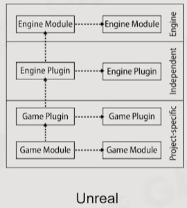
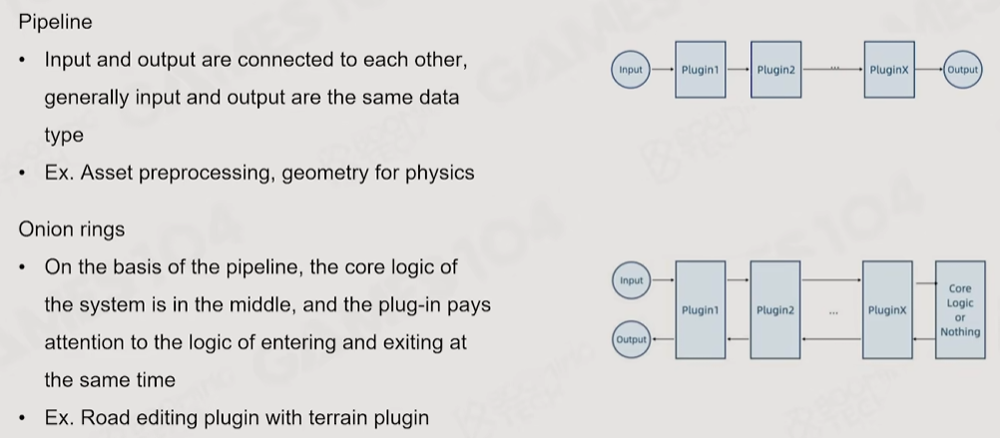

# 游戏引擎工具链

目标是让不同职责的人在一起工作。

## 所属工作

- 从[GUI实现模型](../../CodeBase/DesignPattern#其他-gui实现方式)到设计模式（如MVC、MVVM）
    - unity 的 ugui 属于 Immediate Mode

- 序列化和反序列化，如unity的yaml。

- 实现 Asset Reference (资产的引用)，并提供Variant（变体）的能力
    - unity 的 prefab

- Asset的向前向后兼容
    - 如unity的writeTypeTree，google的protobuf

- level/Asset编辑
    - undo/redo，[命令模式](../../CodeBase/DesignPattern#命令模式)的运用

- 工具链的基石，schema系统，通过已有类型定义复杂类型。有两种方式
    - 如untiy的inspector中，monobehavior和material的编辑
    - 

- 数据需要展示成方便人类理解的版本，如欧拉角和弧度角

- 所见即所得，编辑完可以快速play看效果，导致工具链在架构上不能独立于游戏引擎
    - 两种实现方式 `Play in Editor` 和 `Play In PIE World`，前者play时变动的属性会影响到editor
    - 

- 可扩展性，允许第三方开发者实现自己的工具链
    - 尽可能提供全部的API支持

- *协同开发，编辑同一个文件时不产生难以解决的冲突 -> 在线同时编辑（很复杂的问题）

- *版本控制
    - 王希说没有10年经验不要想这个事情【2】

## 插件结构

插件（Plugin）模式，是一种在商业软件和游戏引擎中非常常见的设计思想。它的核心是将系统拆分为核心框架和可扩展插件，让功能可以灵活增减，而不需要修改核心代码。

plugin的模式
- Covered和Distributed，区别就是出现功能重写时，前者后加载的覆盖前加载的，后者会Merge
- Pipeline和Onion rings，太抽象了看图吧
    - 

## 参考
1. [GAMES104现代游戏引擎课程的第十三讲-bilibili](https://www.bilibili.com/video/BV11T411G7qB)
2. [GAMES104现代游戏引擎课程的第十四讲-bilibili](https://www.bilibili.com/video/BV1QN4y1u78P)