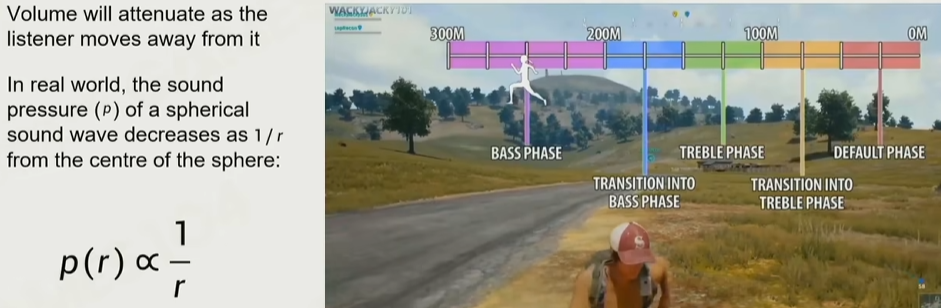
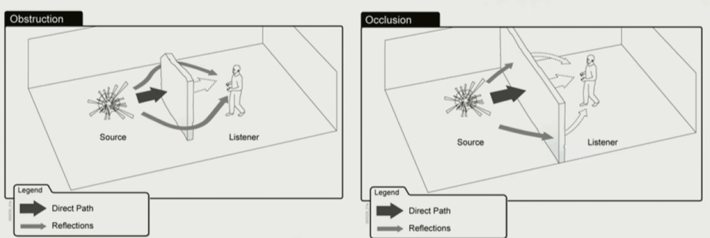
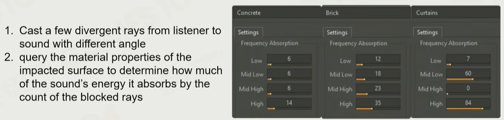
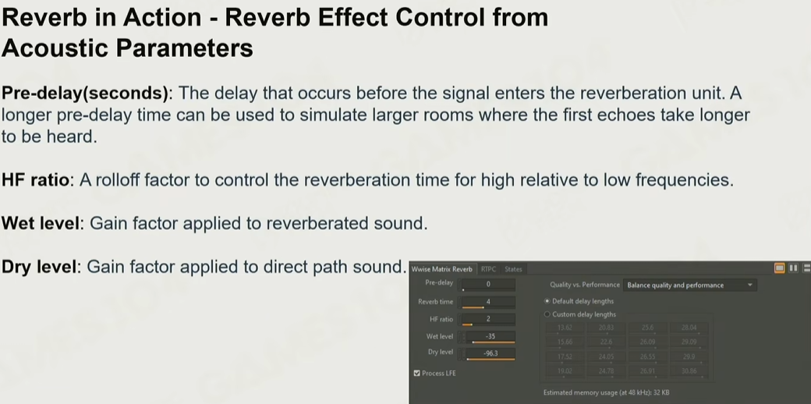

# 声音系统

游戏引擎中声音系统的实现，一般通过专用中间件处理后再丢入工程中（如fmod、Wwise）

## 衡量指标-分贝的定义
声压级（`L_p`​）：声音有效压力相对于参考值的对数度量，国际单位为分贝（dB）

`L_p​ = 20 * log10​(p/p_0​)` dB

`p_0`​：参考声压，即人类听觉的阈值，在空气中常用的取值为

`p_0 ​=20` μPa

（大致相当于一只蚊子在 3 米外飞行时发出的声音）

## 实现细节

- Listener的选取：第一人称游戏可以直接放到相机，但第三人称就需要考虑很多了（可能放在相机和角色中间某个位置）

- 空间感的构建：声音大小、到达左右耳的差值、到达左右耳的音色变化等

- Panning（移动摄像机，这里指音源的移动）： 移动音源需要归一化，保证最终多声道播放的强度贴合实际（很多经验算法）

- attenuation（衰减）：根据声源距离不同，声音的衰减并非分贝的加减（因为低频和高频随距离衰减的速度不同），早期通过录制几种不同距离的声音插值实现，现在可通过中间件实现
    - 点声源、柱型声源（小溪）、盒型声源
    - 

- 阻挡：
    - 简单但高消耗方法：raycast+进一步采样积分+根据材质配置衰减参数，用于重要的声音反馈（如射击游戏）
    - 
    - 

- 混响：干音（Dry）和湿音（Wet）
    - 一般由经验模型实现
    - 

- 多普勒效应，如飞机引擎声音模拟

## 参考
1. [GAMES104现代游戏引擎课程的第十二讲-bilibili](https://www.bilibili.com/video/BV1bU4y1R7x5)