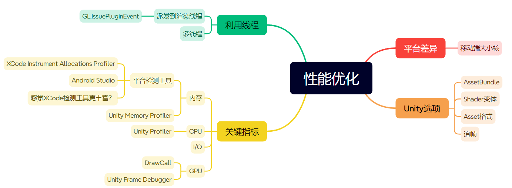

# 性能优化

性能优化可以从以下四个方面着手

## 平台差异
提示词：移动端大小核（需要重点展示调度规则和相关文档）

## 关键指标
提示词：内存、CPU、GPU、I/O

## Unity选项的影响
提示词：AssetBundle、Shader变体、Asset格式、在不必要的时候不开启追帧。描述上述相关的unity选项的影响，如mipmap在不需要的时候关闭可以节约1/3内存。

## 利用线程
提示词：多线程、游戏逻辑派发到渲染线程。描述上述技术在何时应该使用，以及需要注意的点。

## 参考