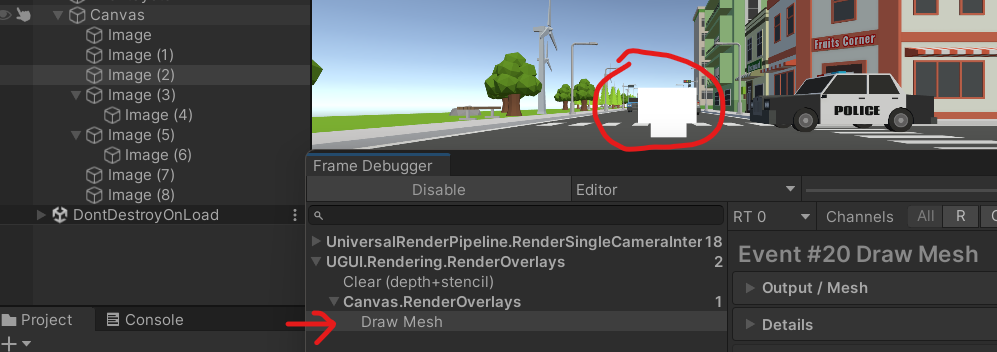

# 性能优化-UI篇

主要针对UGUI，总结了一些性能优化上的思路。

UI的性能优化可以分为三个方向：
1. 减少draw call提交的次数，从而减小总I/O
    - 触发动态合批（dynamic batching），首先通过图集合并细小的UI，会增加一定量的CPU开销。
    - 减少图片大小，使用九宫格图等技巧。
2. 减少Canvas Rebuild消耗
    - 对于触发Rebuild频繁的组，使用多个画布（平行或内嵌），实现动静分离。
    - 非必要不使用布局（Layout）
3. 针对特定场景
    - 对于有大量元素的列表，采用分页式设计，不加载被mask的元素。
    - 。。。

最后，还要通过Profiler或Frame Debugger方式验证优化结果，[UGUI Manual](https://docs.unity3d.com/Packages/com.unity.ugui@2.0/manual/ProfilerUI.html)中，提到了Profiler的关键指标。

> 当然，实际实施过程中，有时为了美术效果或设计方便，往往使UI难以采用优化策略。如合批方面，当多个必要的材质在层级上混合，且由Animation在层级上控制时，就不是打个图集就能完事得的了。（理想和现实的差距）

## 动态合批

UI的合批规则和3d物体的合批规则之间有一定的差距，而且还随unity版本不同，合批规则也有一定差距。

> 由于UI动态合批的规则代码并没有公开，所以想要理解这一点更为困难。

不过根据**道听途说**总结的经验来看，合批算法的关键思路是，将（每个UI元素代表的）网格依次按`遮挡层级`、`材质`、`贴图`进行排序，如果相邻的节点在`材质`、`贴图`上一模一样，则可以合并。

最极端情况的一个表现为，一堆空`Image`胡乱叠在一起，在FrameDebugger下只占一个draw call。

当然除了关键思路之外，还有一些额外的机制。比如【1】中提到的`Unity can’t apply dynamic batching to meshes that contain more than 900 vertex attributes and 300 vertices`，但考虑到图片占4顶点、UGUI Text占{文字数量*4}顶点，且文字不能和图片合并，这一点在大多数情况可以忽略。

::: details 阅读URP UI渲染代码相关

对于URP管线，Canva是Screen Base：代码入口从 `UniversalRenderPipeline.RenderSingleCamera` 开始，经过 `ScriptableRenderer.Execute` 和具体的渲染Pass，就到了 `_Internal` 结尾的内部方法中了。然后偷偷的调 `Canvas.RenderSubBatch`

通过阅读代码发现：
- 入口：UniversalRenderPipeline.RenderSingleCamera -> ScriptableRenderer.Execute -> "UGUI Render Logic" -> _Internal
- CommandBuffer是渲染命令

NGUI的DrawCall提交代码是能看的，可以根据这个参考合批做的事情和一些逻辑。

:::

## Rebuild

为了使UI每帧能渲染出正确的状态，UGUI的`Canvas Update`每帧都要判断是否需要Rebuild，这里采用脏标记的设置方式，基本一点小小的UI改动都可能将画布置脏，具体而言：`SetLayoutDirty`、`SetVerticesDirty`、`SetMaterialDirty`。

### 让AI总结了一下将画布置脏的具体操作：

通过 SetLayoutDirty() 触发：
|          场景          |                 代码位置                  |
| --- | ----------- |
| RectTransform 尺寸变化 | Graphic.OnRectTransformDimensionsChange() |
| 父级变化               | Graphic.OnBeforeTransformParentChanged()  |
| 激活/禁用              | Graphic.OnEnable()/OnDisable()            |
| 组件启用               | LayoutGroup.OnEnable()                    |

通过 SetVerticesDirty() / SetMaterialDirty() 触发：
- Graphic.cs:148 - color 变化
- Image.cs:279 - sprite 变化
- Image.cs:439 - fillAmount 变化（进度条更新）

其他触发点
- Text 组件：文字内容变化、字体变化
- Image 组件：sprite、fillMethod、preserveAspect 等变化
- RawImage：texture、uvRect 变化
- Mask/MaskableGraphic：遮罩状态变化
- MeshEffect（Shadow/Outline）：启用/禁用/修改参数

::: details 阅读UGUI代码相关

在UGUI的[入口函数`CanvasUpdateRegistry.PerformUpdate`](https://github.com/Unity-Technologies/uGUI/blob/2018.4/UnityEngine.UI/UI/Core/CanvasUpdateRegistry.cs)中，可以明确看出，主要影响UGUI在渲染前阶段的性能，就是不同UI元素的`Rebuild`方法。

OnPopMesh
Rebuild Layout

:::

### 如何避免Rebuild

- 下面提到的动静分离
- 用rectTransform移到屏幕外代替 `setActive(false)`
- 通过改material颜色代替`color=...`（会产生额外drawCall）

一般不出现很严重的性能问题不会考虑后两种情况，毕竟对代码逻辑影响挺大的。

## 动静分离

动静分离，动和静是相对而言的，比如说RPG中的多背包视图，那肯定最好一个背包视图一个Canvas。

WIP：实验

## 参考
1. [动态合批 - Unity Doc](https://docs.unity3d.com/2021.3/Documentation/Manual/dynamic-batching.html)
2. [嵌套画布优化 - 阿严Dev, Youtube](https://www.youtube.com/watch?v=D3m_pfJ1nwQ)
    - [Nested Canvas Optimization 2019.3 - Learn unity](https://learn.unity.com/tutorial/nested-canvas-optimization-2019-3#)
    - [Unity UI 优化技巧 - Unity HowTo](https://unity.com/cn/how-to/unity-ui-optimization-tips)
3. [Unity UI (uGUI) 2.0 - Unity Manul](https://docs.unity3d.com/Packages/com.unity.ugui@2.0/manual/index.html)
4. [UGUI 1.0 - github](https://github.com/Unity-Technologies/uGUI/tree/2018.4)