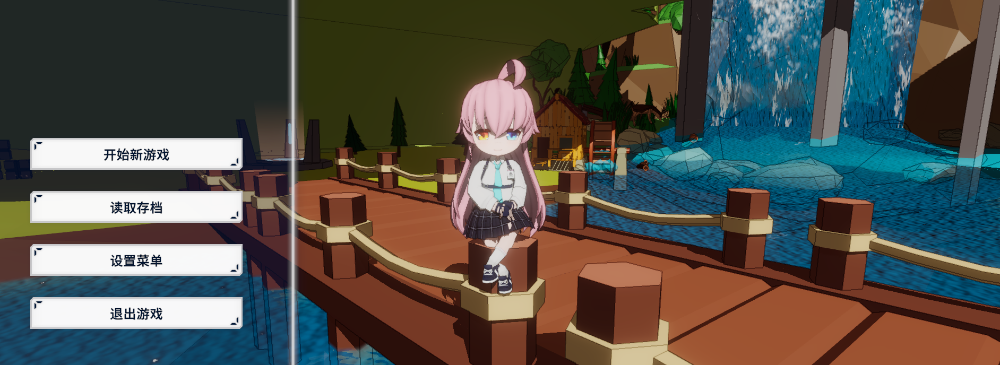

# 作品

## 上帝视角射击游戏

上帝视角射击游戏 (简称为: MyTDS)，是个人项目，目的在于探索unity的api，以及尝试实现个人游戏生涯中的一些想法。项目以实现Gameplay功能为主，画面表现仅做一些简单的探索和学习（渲染、建模、粒子特效和UI设计）。

游戏主要规划了两个场景，分别是家园和战斗场景，分别对应着养成模块和以枪械为主的上帝视角对战模块（PVE）。养成模块尝试实现二次元养成游戏常见的资源获取和角色培养功能（建筑和抽卡），战斗模块尝试实现类骑砍的率领队伍对抗敌方队伍的即时战斗模式。**详细流程可见下方的"游戏流程图"和对应的[视频回顾](https://www.bilibili.com/video/BV136421g7vi)。**

开发环境和使用工具：Unity2022.3，Visual Studio 2022，VS Code，Git

项目开源到[GitHub](https://github.com/Unarimit/my-topdown-shooting-game)

### 附件

 游戏流程图 

[游戏流程-视频ver Bilibili](https://www.bilibili.com/video/BV136421g7vi)

## 个人主页-我要成为U3D高手

个人主页记录了我的学习过程和学习成果，写文章是为了回顾学会或看到的知识，而且公开的方式也更能督促自己完善一些概念。为了使文章更有条理，总结了一套书写模式。

开发环境和使用工具：VuePress V1，VS Code，Git

项目开源到[GitHub](https://github.com/Unarimit/unarimit.github.io)

### 附件

 编写时的场景 

