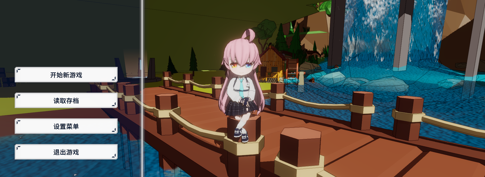
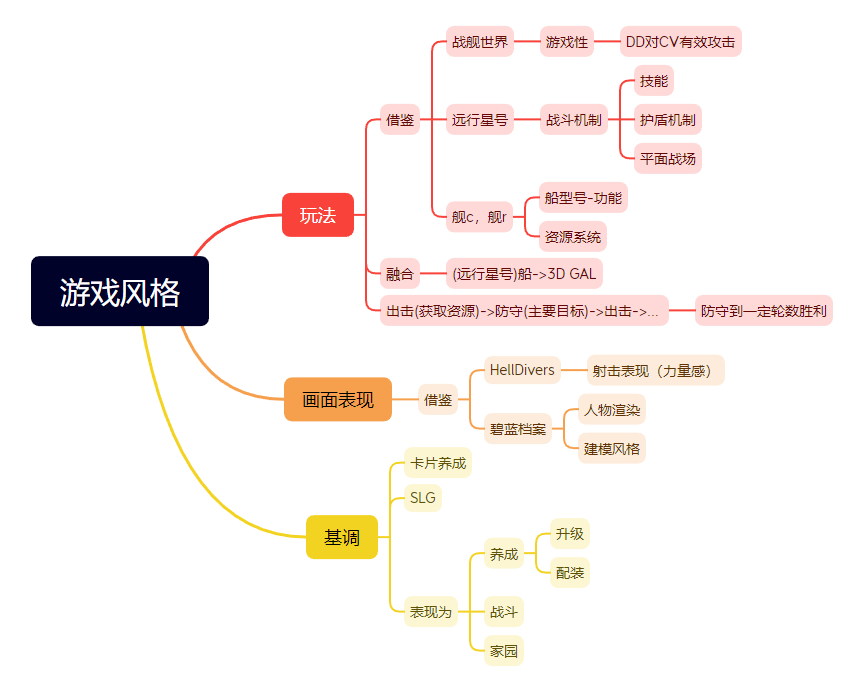
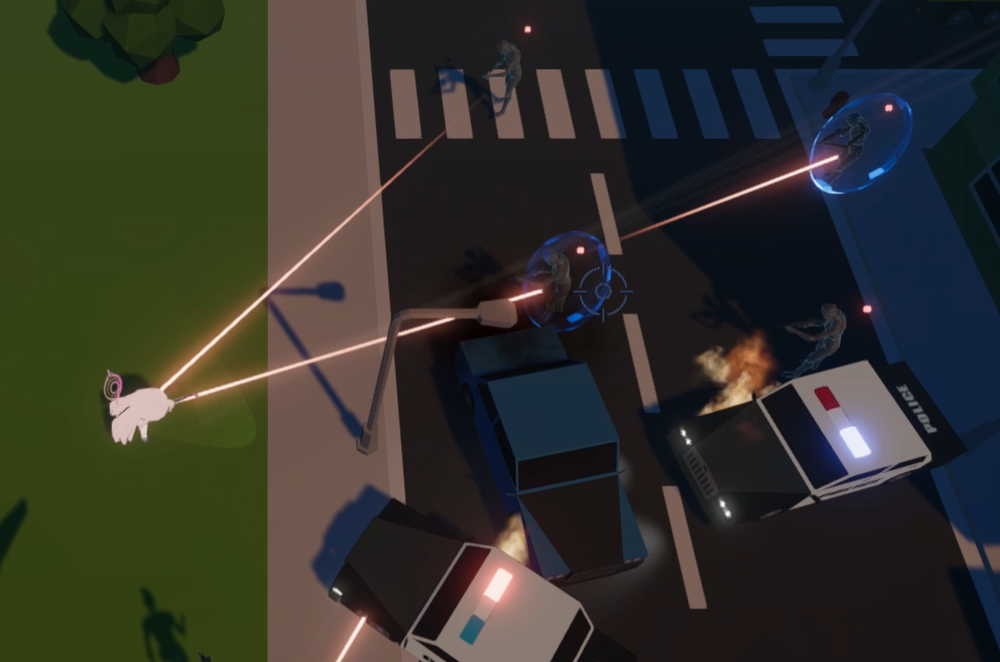
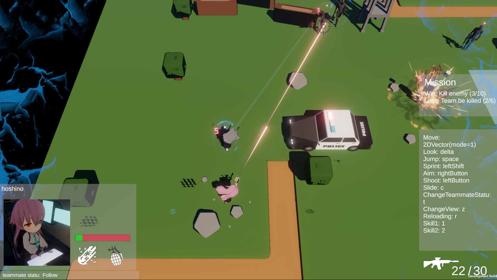
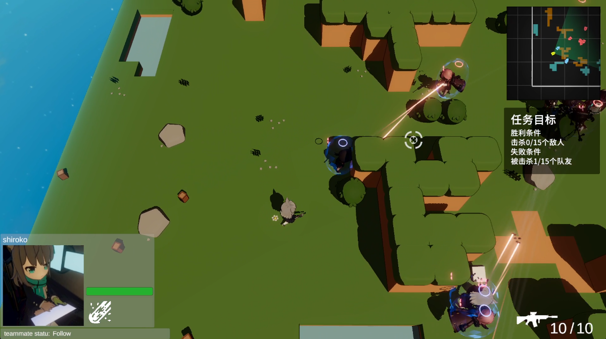
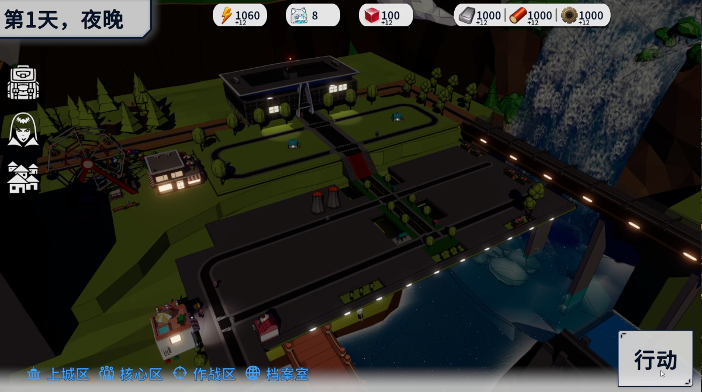

# 上帝视角射击游戏-2023

上帝视角射击游戏 (简称为: MyTDS)，是个人项目，目的在于探索unity的api，以及尝试实现个人游戏生涯中的一些想法。
> 在美术和画面表现方面没用任何创新性，使用了网上流传的某热门二次元手游的角色模型（

开发采用迭代的方式进行，将规划内容按照主题分类，按照“想做的程度”排序。主题和顺序如下：
- 原型-战斗场景原型 -- 2023.8.21 - 2023.8.27 （附视频演示）
- 第二版-完善画面表现和设定 --  2023.10.8 - 2023.11.10（附视频演示）
- 第三版-战斗场景扩充和规则化加载 -- 2023.11.10 - 2023.12.10（附视频演示）
- 第四版-家园场景（资源系统&动画编辑） -- 2023.12.14 - 2023.12.32（附视频演示）
- 第五版-存档功能、热更新和AI -- 2024.1.15 - 2024.2.10

**现在**处于项目初期，放弃对手感、画面、流程的打磨，主要实现相关功能。

游戏想法&大纲：

## 原型 8月21 - 8月27
1. 在unity的第三人称模板基础上改进
2. 导入fbx模型和动画
3. 使用Animator完成动画控制逻辑
4. 导入搭建好的简易场景，完成游戏场景搭建
5. 更改渲染风格（仅限角色）。并改动了一些shader：光照接受方面和阴影渲染部分的的hlsl和shader代码
6. 加入一些特效增加射击手感（使用粒子系统）
7. 通过状态机加入简单的NPC自动控制，完成敌军和友军概念的建立

整个流程经历8天，净时间大概42小时

[B站视频介绍 - 从零开始的上帝视角射击游戏制作！！01](https://www.bilibili.com/video/BV1Uh4y1N7sK/)

[源代码 ver0.1](https://github.com/Unarimit/my-topdown-shooting-game/tree/version0.1)

## 第二版 10月8 - 11月10

升级Unity版本至2022.3

新增主要功能
1. 枪械完善
    - 换子弹动作，动作冲突优先级
2. 增加技能系统
    - 代码控制，技能特效
3. UI补充
    - 操作说明，任务说明，驾驶舱视角，人物状态，任务状态。
4. 场景搭建&关卡设定

已有功能优化
1. 逻辑解耦
    - 分离武器和人物类
    - 文件结构优化
2. AI优化，NevMesh替换自己写的无脑走路功能
3. 技能系统
    - 将技能释放规范化，可以通过一个json文件定义技能
4. 更换渲染方案
    - NiloExample -> FernNPR

整个流程经历30天，由于期间事情比较多，大概只有15天的每天6小时花在项目上

[B站视频介绍 - 从零开始的上帝视角射击游戏制作！！02](https://www.bilibili.com/video/BV1Uh4y1N7sK/)

[源代码 ver0.2](https://github.com/Unarimit/my-topdown-shooting-game/tree/version0.2)

## 第三版 11月10 - 12月10日

新增主要功能
1. 新场景：出战准备场景
2. 随机算法：游戏作战场景生成
3. “游戏模式”定义，以及三个游戏模式
4. 丰富战场元素，增加"航母"类型
5. 丰富战场元素，增加战略地图页面，可以切换操作单位
6. 战斗结束的结算页面

已有功能优化
1. 技能系统优化
    - 释放过程改为“释放器”，“选择器”，“影响器”模式
    - 射击、滑铲等技能都使用配置文件实现
    - 可以通过csv写配置文件
2. 存储系统服务化
    - 通过服务定位器配置存储内容，以便在之后开发的文件数据存储系统中切换
3. 逻辑解耦
    - 玩家控制和ai控制组件可以自由切换
    - 母舰逻辑在原有ai控制组件上拓展
    - 使用拓展方法实现常用搜索函数
4. 场景画面表现优化
    - 天空盒、待机动画、主页场景、准星动画效果、按键提示移到菜单

整个流程经历30天，大概有24天的每天6小时花在项目上

[B站视频介绍 - 从零开始的上帝视角射击游戏制作！！03](https://www.bilibili.com/video/BV1Me411y7hL)

[源代码 ver0.3](https://github.com/Unarimit/my-topdown-shooting-game/tree/version0.3)

## 第四版 12月14 - 12月32
家园场景（资源系统&动画编辑）

1. 家园场景搭建
    - 使用Blender搭建简单的地形原型
    - 拼接各种资源素材
2. 家园资源设定
    - 设定相关的战斗消耗资源（如弹药，角色体力）、养成机制资源（如抽卡资源）
3. 家园养成模块
    - 通过产能建筑获取资源，防卫建筑助力防卫战
    - 通过抽卡功能获取角色和装备
4. 游戏目标-入侵事件
5. 延时事件系统和非战斗关卡
6. 表现优化
    - 抽取角色时的动画
    - 主页待机画面&用角色装饰家园
    - UI风格化
    - 人物模型运行时配置shader和头发裙子骨骼

整个流程经历18天，大概有15天的每天6小时花在项目上

[B站视频介绍 - 从零开始的上帝视角射击游戏制作！！04](https://www.bilibili.com/video/BV1kk4y1X7JK)

[源代码 ver0.4](https://github.com/Unarimit/my-topdown-shooting-game/tree/version0.4)

## 第五版 1月15 - 2月10
存档功能、热更新和AI

1. AI - 6天完成
    - 设计基于GOAP和行为树的AI模块
    - 构建战斗单位的GOAP图
    - 对应具体行为的行为树
    - 使用JobSystem，使AI计算在另一个线程中进行
2. 存档功能 - 1.5天完成
    - 设计存档摘要类，展示存档
    - 序列化游戏状态
3. 基于XLua的热更新 - 4天完成
    - 通过Lua更新`Database`类的内容（如添加新的关卡）
    - 通过Lua拓展技能系统（拓展技能系统，设计Lua专用的技能释放器）

整个流程经历25天，大概有11天的每天6小时花在项目上
> 因为在准备面试、玩新出的白荆回廊和放寒假，有点摆。而且这些部分要看一些理论上的东西，说服自己去看相对困难。

因为这些功能难以简单的通过画面展示，故这一阶段没有视频计划

[源代码 dev-with-xlua](https://github.com/Unarimit/my-topdown-shooting-game/tree/dev-with-xlua)

