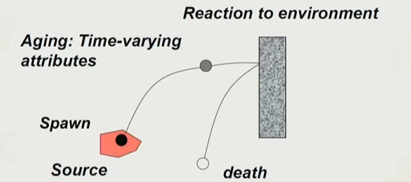
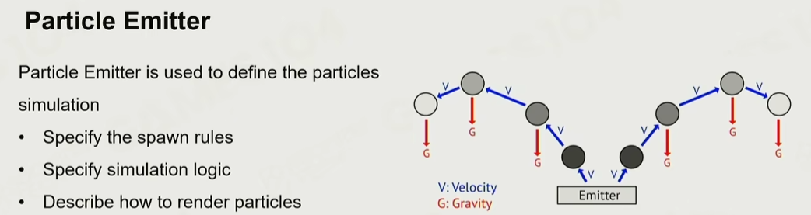
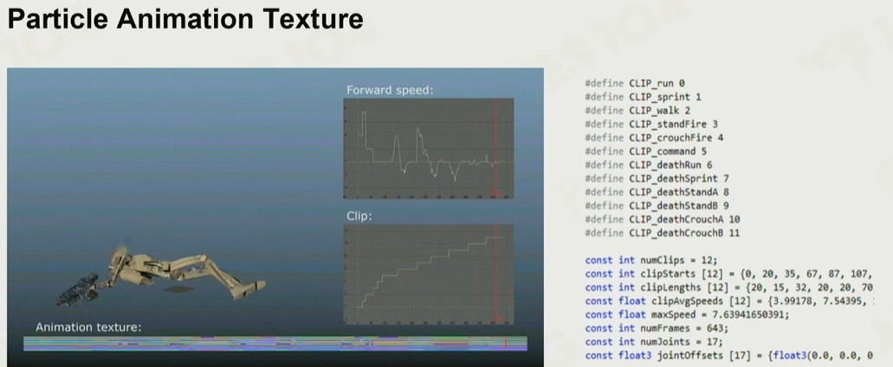

# 粒子系统

为了制作各种特效，就有了粒子系统

一个火焰特效可由：一个烟雾粒子发射器+一个火焰粒子发射器+一个火花粒子发射器构成。而粒子一般是一个billboard帧动画

## 基本定义

- 属性：位置、速度、大小、颜色等，都是粒子的基本属性。正是由这些基本属性的组合，产生了各种别致的特效

- 生命周期：除此之外，还有一个小生命周期，一般和渲染一起由游戏引擎实现：

- 粒子发射器：速度和重力以及各种属性随时间的变化

- 参与碰撞：Depth Buffer Collision

- 粒子类型：billboard（永远朝向相机的面片）、mesh、ribbon（拖尾效果）

- *进阶-粒子动画：如人群模拟，环境互动等，需要获取环境信息（周围的其他粒子、主控位置、状态机等）赋予粒子避障、寻路、动画等功能

## 粒子很多，面临渲染挑战

- 透明排序
    - 降采样生成深度图

- GPU粒子，生命周期、碰撞、位置等在GPU内算完

## 参考
1. [GAMES104现代游戏引擎课程的第十二讲-bilibili](https://www.bilibili.com/video/BV1bU4y1R7x5)