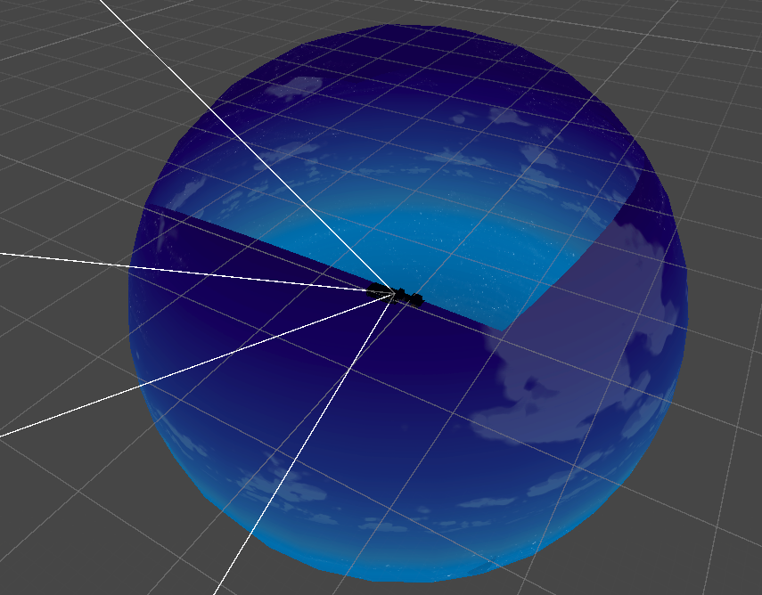
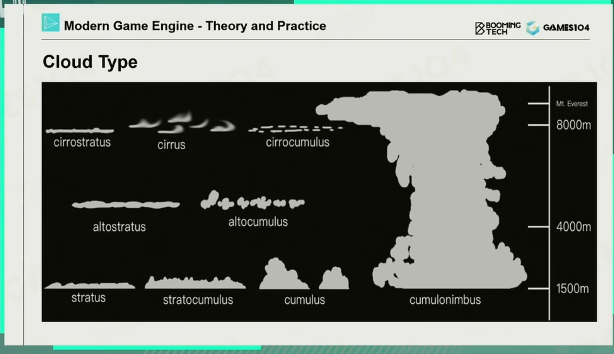
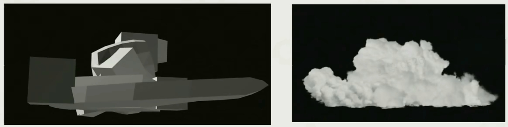
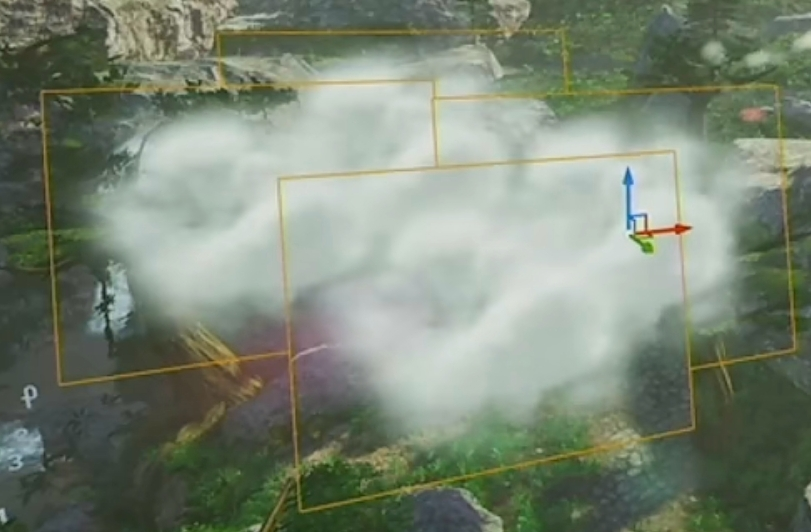

# 天空和云
本章是对GAMES104现代游戏引擎课程的第六讲（下）中提到的技术的总结[1]，并结合了相关资料。

## 天空盒
简单的天空盒一般会将一些高清的立方体纹理（cubemap）映射到天空盒的6个面，而一些具有特殊美术风格的游戏，会考虑利用简单公式和因素叠加，来产生可以动态调节参数的过程化天空盒[2]。

为了节约成本，也可以将云绘制在天空盒上，并通过转动天空盒模拟云的飘动效果。

## 预计算大气散射－基于大气散射模型的真实天空渲染
相较于天空盒，基于对大气中真实物理模拟的天空渲染具有更好的表现，经常应用于3A游戏中。其运算相比天空盒更为昂贵，并由此诞生了一系列优化手段。
- 单次散射与多次散射，考虑多次散射的停止条件
> 单次散射是光经过一次散射到达观察者，多次散射是光经过多次散射，多次散射的计算更为复杂但能呈现更真实的大气效果。
- 光线步进（Ray Marching）是计算单次散射辐射的常用方法（积分离散求解），通过沿光线分段计算并累加辐射值，通常会将预计算，并将计算结果存储在查找表（LUT, look up table）中以提高效率。

### 预计算大气散射的挑战
在移动设备上生成和存储大尺寸LUT困难、难以动态调整环境参数、难以渲染极端天气和太空场景、运行时采样开销大等。
生产友好的快速天空和大气渲染方法：通过简化多次散射（如仅考虑二阶及以下的各向同性多次散射，忽略可见性）、固定观察位置和太阳位置以减少LUT维度、生成3D aerial-perspective LUT来评估 aerial-perspective 效果等方式，在性能和效果之间取得平衡，这种方法可在从移动设备到高端PC的平台上扩展。[3]
 
## 云的渲染

### 云的种类

### 云的三种实现方法
- 基于网格的云建模（Mesh-Based Cloud Modeling）：优点是质量高，缺点是整体开销大，不支持动态天气。
    > 通过简单模型＋shader实现 

    

- 公告板云（Billboard Cloud）：优点是高效，缺点是视觉效果有限，支持的云类型少。

    

- 体积云建模（Volumetric Cloud Modeling）：优点是能呈现各种云的外观、支持大尺度云、支持动态天气和体积光照/阴影，缺点是需要考虑效率问题，是当前实现真实感云渲染的主流方法。

### 体积云的实现

- 天气纹理（Weather Texture）：通过噪声纹理和高度图的结合来生成不同的云形态。
- 噪声函数（Noise Functions）：如柏林噪声（Perlin Noise）、沃利噪声（Worley Noise）、 Voronoi 等，用于生成云的自然形态。
- 云密度模型：从基础分布到结合多种噪声（如多频柏林噪声）的复杂模型，以实现更真实的云密度分布。
- 光线步进渲染体积云：分为四个步骤，首先为每个屏幕像素发射光线，然后大步长步进直到进入云体，接着在云内部进行密集采样，最后收集来自太阳的散射辐射，从而得到云的最终渲染效果。
    > 这里的步进查询需要依赖相应的数据结构标记云的密度，并提供快速查询的方式。可能会用八叉树或体素网格
 
## 参考
1. [GAMES104现代游戏引擎课程的第六讲（下）-bilibili](https://b23.tv/5f2LuJF)
2. [从零手写游戏引擎9：天空盒 -知乎](https://zhuanlan.zhihu.com/p/389074457)
3. [UE4新版大气实时渲染-论文导读 -知乎](https://zhuanlan.zhihu.com/p/150963038)