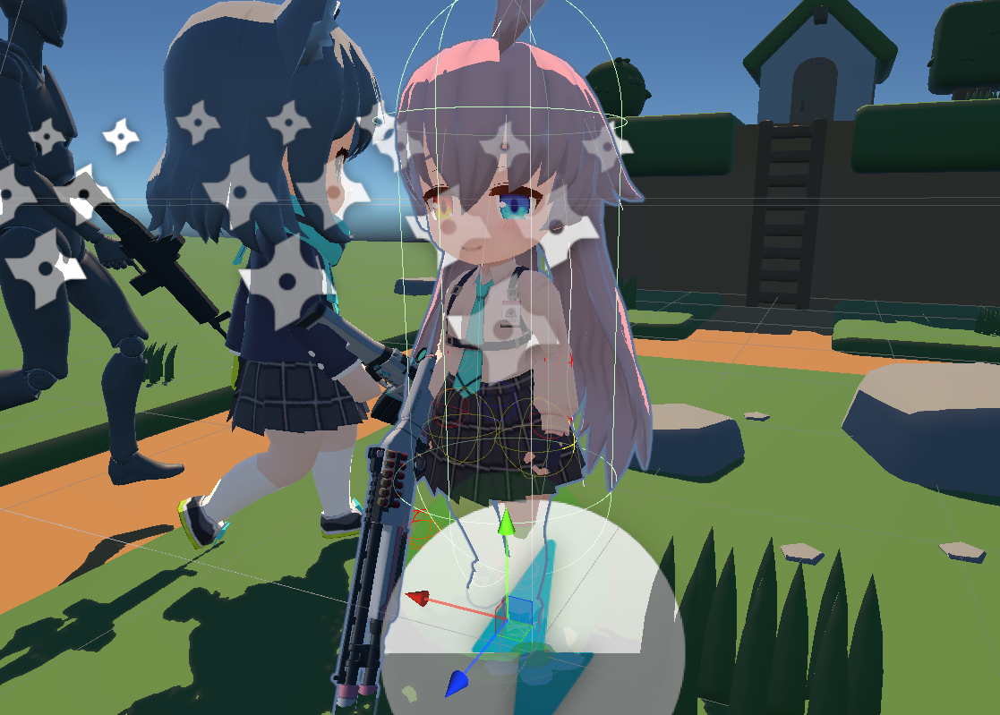

 

# 角色控制

作为3c之一，角色控制包含的细节和打磨是很重要的

角色控制即把玩家的输入转化为角色的动作响应。可能需要考虑：
- 角色动画（Animator）和效果控制
- 动作和实际坐标变化之间的协调
- 输入和当前角色行为冲突和优先级
- 和场景的互动（拾取，脚印等）
- 角色死亡和重生
- 镜头控制（Cinemachine）
- 。。。

实现一个简单的角色控制并不难，但当需求叠加在一起，实现过程中不断地维护可能出现各种各样的问题：
- 可以使用[命令模式](./../GameCodeDesign/DesignPattern.html#命令模式)，方便做网络同步以及解耦动作和控制代码，对于一些动作游戏，也方便指令缓存的实现
- 角色与世界的物理规则是复杂的（见【1】中的角色控制器的描述），实现时需要仔细封装以备后续迭代
    - 如下楼梯、斜坡滑步、攀爬等
    - 和场景的交互需要和地编等技术一起制定规范，例如为了防止被建筑卡住，门会设计的比正常大小大一圈

## CharacterController

unity提供的简单控制角色的方法，实现了大多数3D游戏中共有的控制规则，属于物理系统的一部分，有：
- Move函数
- 胶囊碰撞箱（在物理系统中作为kinematic对象，空间不够会过不去）

> 另外他的碰撞检测好像不受与他碰撞的物体的rigidbody中检测方式的影响，一直是离散检测。在做射击检测时发现这个问题。

## 网络传输延迟处理和命令模式

这是一个比较难的点 WIP

## 参考
1. [GAMES104现代游戏引擎课程的第八讲-bilibili](https://www.bilibili.com/video/BV1jr4y1t7WR)
2. [Character Control - Unity Doc](https://docs.unity3d.com/cn/current/Manual/character-control-section.html)