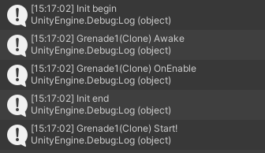

# 生命周期(MonoBehavior)

::: tip
笔面试中，特别喜欢考`Awake`,`OnEnable`,`Start`,`FixedUpdate`,`Update`的执行顺序。除此之外，还需要掌握一些针对特殊需求的实现方法。例如`Update`里适合写什么逻辑等、`FixedUpdate`里适合写什么逻辑等。
:::

## 按照执行顺序介绍

- `Awake`：始终在任何`Start`函数之前并在实例化预制件之后调用此函数。（如果游戏对象在启动期间处于非活动状态，则在激活之后才会调用`Awake`）
- `OnEnable`：（仅在对象处于激活状态时调用）在启用对象后立即调用此函数。在创建 MonoBehaviour 实例时（例如加载关卡或实例化具有脚本组件的游戏对象时）会执行此调用。
- `Start`：仅当启用脚本实例后，才会在**第一次帧更新之前**调用`Start`。
    - 若运行中加载`Monobehaviour`，**可能会**导致更新先于`Start`执行。
- `FixedUpdate`：`Time.deltaTime`固定的`Update`。（默认一秒50次）
- `Update`：每帧调用一次.
- `LateUpdate`: 每帧调用一次, `LateUpdate`开始时，在`Update`中执行的所有计算便已完成。

<center>来张官方的图</center>


## 同一函数的更新顺序

如要改变不同脚本Awake函数的执行顺序，可以在`Project Settings -> Script Execution Order`中排序脚本执行顺序。

参考:[Script Execution Order 设置 - Unity doc](https://docs.unity3d.com/cn/current/Manual/class-MonoManager.html)

## 例子

### 时间停止 & 时间加速

在一些rts中（如群星）玩家需要暂停时间进行一系列复杂的操作；又或是手游中的二倍速、三倍速战斗，所以如何实现暂停时间和加速时间的逻辑呢（除了UI之外的游戏逻辑都必须停止）

暂停时间 - 实现方法：
- 设置`Time.timeScale = 0`
- 如果要恢复时间，在`Update`或协程中执行判断逻辑恢复`Time.timeScale = 1`
    - `Time.timeScale = 0`时`FixedUpdate`不会执行，所以UI逻辑应该放到`OnGUI`或`Update`中

加速时间 - 实现方法：
- 设置`Time.timeScale = k`, k > 1, k为2就是加速两倍


在下面的代码中，可以观察到一次`fixedUpdate`和随时间不断增加的`update`
``` csharp
// 这是一个挂载了的 MonoBehavior
private void Awake()
{
    Time.timeScale = 0;
}
private void Update()
{
    Debug.Log("update");
}
private void FixedUpdate()
{
    Debug.Log("fixedUpdate");
}
```

::: details 一个gpt回答错误的例子
当`Time.timeScale`的值为0时，`Update`和`FixedUpdate`函数将不会被调用。

- `Update`函数是在每一帧绘制之前被调用的，通常用于处理与时间相关的逻辑和更新游戏对象的位置、动画等操作。当`Time.timeScale`为0时，即时间停止，`Update`函数将不再被调用，因为游戏逻辑因为时间停止而暂停。

- `FixedUpdate`函数用于处理物理模拟，它在固定的时间间隔内被调用（默认为每秒调用50次，可以在Project Settings中修改）。与`Update`函数不同，`FixedUpdate`函数受到`Time.timeScale`的影响，在时间停止时仍然会被调用，但是由于时间缩放为0，物理模拟的计算也会暂停。

因此，当`Time.timeScale`为0时，`Update`和`FixedUpdate`函数都将停止执行。如果你想在时间停止时执行特定的逻辑，可以考虑使用协程（Coroutine）或其他方式来模拟所需的行为。

:::

### Start和Awake

在一次项目开发中，我发现我在某个`Start`中初始化的一个变量居然找不到引用。仔细一看是因为我初始化prefab之后就立刻调用了这个MonoBehavior的一个函数，导致`Start`中的逻辑还没有进行。然后把变量初始化放到`Awake`里面，解决了这一空引用问题。

在下方的代码中，可以观察到这些函数的优先级。

初始化prefab代码：

``` cs
Debug.Log("Init begin");
Instantiate(prefab);
Debug.Log("Init end");
```

prefab中挂载的脚本代码

``` cs
// A MonoBehavior
private void Start()
{
    Debug.Log(gameObject.name + " Start!");
}
private void OnEnable()
{
    Debug.Log(gameObject.name + " OnEnable");
}
private void Awake() 
{
    Debug.Log(gameObject.name + " Awake");
}
```
Console的输出




根据对上方代码和输出的观察，初始化后的对象，会立刻调用`Awake`和`OnEnable`函数（在一个`Awake`函数中初始化对象也同样）。这个现象和[unity doc](https://docs.unity3d.com/cn/current/Manual/ExecutionOrder.html)中的:

> 请注意，对于添加到场景中的对象，在为任何对象调用 Start 和 Update 等函数之前，会为_所有_ 脚本调用 Awake 和 OnEnable 函数。当然，在游戏运行过程中实例化对象时，不能强制执行此调用。

存在差异，有待进一步确定。


## 参考
- [Order of execution for event functions - Unity Documentation](https://docs.unity3d.com/Manual/ExecutionOrder.html)
- [Script Execution Order 设置 - Unity doc](https://docs.unity3d.com/cn/current/Manual/class-MonoManager.html)