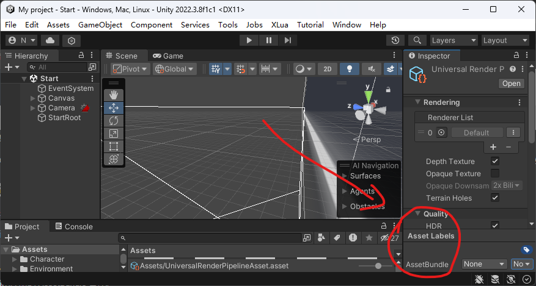

# 资源管理

Unity提供`Resource`、`AssetsBundle`(俗称ab包)和`Addressable`API用于管理资源。
> Unity2018之前关于自行构建使用`AssetsBundle`的资源管理的方案已被标记为"out of date"，被`Addressable`替代。

以下是这些API的区别：

- `Resource`: 简单易用😁，所有资源全部加载到内存😡，不支持热更新😡
- `AssetsBundle`: 根据需要装载和卸载资源😁，管理较为困难😡
- `Addressable`(一套`AssetsBundle`的管理方案): 分组管理😁，异步加载😁，学习成本较高😡

对于较小的项目或不需要频繁更新资源的情况下，可以使用简单的 Resource 管理方式。而对于大型项目或需要动态加载和更新资源的情况下，更推荐使用灵活的 Addressable 方式来管理资源。
> 也有一些工作室会写一套逻辑管理`AssetsBundle`

## Resource

::: warning
Resources 文件夹是 Unity 项目中许多常见问题的来源。Resources 文件夹的使用不当会使项目构建出现膨胀，导致内存消耗过高，并显著增加应用程序启动时间。
:::

用于动态的载入prefab，贴图等素材(不需要在inspector中拖动)。相对于放在其他地方的资源，Resource下的必定会被打包发布，其他资源只有在打包的场景使用到的时候才会被打包发布。

Resource的工作流程分为两个个步骤：

1. 准备资源：把资源放在`[项目名]\Assets\Resources\`下
2. 使用资源：通过`Resources.Load`载入资源。如：`Resources.Load<GameObject>("shpere");`，这里通过泛型限定了载入类型为prefab
 
### 资源映射表

为了防止`Resources`文件夹下文件结构变动对检索资源造成影响，可以通过写editor脚本，配置资源映射表的方式解决这一问题。

其中，资源映射表应写入`SteamingAssests`文件夹下

## AssetsBundle

如[Unity文档中](https://docs.unity3d.com/cn/current/Manual/AssetBundles-Workflow.html)描述的那样，AssetsBundle的工作流程分为三个步骤：
1. 为 AssetBundle 分配资源
    - 在Asset对象的 Inspector 底部

2. 构建 AssetBundle
    - 需要写一个简单的Editor脚本，主要通过 `BuildPipeline.BuildAssetBundles` 方法
3. 加载 AssetBundle 和资源(Asset)
    - 通过文件加载AssetBundle：主要通过 `AssetBundles.LoadFromFile` 方法
    - 通过网络加载AssetBundle：主要通过 `UnityEngine.Networking.UnityWebRequestAssetBundle.GetAssetBundle` 方法
    - 使用资源：通过`bundle.LoadAsset`方法获取AssetBundle中的资源，如`bundle.LoadAsset<GameObject>("Cube");`

其中设计C#脚本的内容[Unity文档中](https://docs.unity3d.com/cn/current/Manual/AssetBundles-Workflow.html)都给出了简单的样例。

## Addressable

WIP

## 参考
- [Unity资源管理方案 Addressable详解 - changyun的文章 - 知乎](https://zhuanlan.zhihu.com/p/635796583)
- [Unity资源管理系列：Unity Addressable资源管理实战 - 鲨鱼辣椒的文章 - 知乎](https://zhuanlan.zhihu.com/p/541893117)
- [AssetBundle - Unity Doc](https://docs.unity3d.com/cn/current/Manual/AssetBundlesIntro.html)
- [Addressables Manual - Unity Doc](https://docs.unity3d.com/Packages/com.unity.addressables@1.20/manual/index.html)