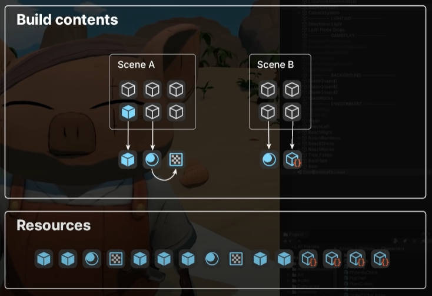

# 资源管理

Unity提供`Resources`、`AssetsBundle`(俗称ab包)和`Addressable`API用于管理资源。
> Unity2018之前关于自行构建使用`AssetsBundle`的资源管理的方案已被标记为"out of date"，被`Addressable`替代。

以下是这些API的区别：
- *在编辑器中直接引用-`AssetDatabase`：简单易用😁，unity会按场景和共用资源提供一定的管理🤔，包体过大问题😡，不支持热更新😡
- `Resources`: 简单易用😁，文件过多时会导致[各种问题](https://learn.unity.com/tutorial/assets-resources-and-assetbundles#5c7f8528edbc2a002053b5a6)😡，[灾难性的内存管理](https://docs.unity3d.com/cn/current/Manual/BestPracticeUnderstandingPerformanceInUnity6.html)😡，文件夹下资源全部发布😡，不支持热更新😡
- `AssetsBundle`: 根据需要装载和卸载资源😁，依赖问题和装载卸载控制使管理较为困难😡
- `Addressable`(一套`AssetsBundle`的管理方案): 分组管理😁，异步加载😁，有一定学习成本😅

对于较小的项目或不需要频繁更新资源的情况下，可以使用简单的 Resource 管理方式。而对于大型项目或需要动态加载和更新资源的情况下，更推荐使用灵活的 Addressable 方式来管理资源。
> 也有一些工作室会写一套逻辑管理`AssetsBundle`

## Resources

::: warning
Resources 文件夹是 Unity 项目中许多常见问题的来源。Resources 文件夹的使用不当会使项目构建出现膨胀，导致内存消耗过高，并显著增加应用程序启动时间。
:::

用于动态的载入prefab，贴图等素材(不需要在inspector中拖动)。相对于放在其他地方的资源，Resource下的必定会被打包发布，其他资源只有在打包的场景使用到的时候才会被打包发布。

  
 相比于在editor中直接引用资源的按需打包，resource文件夹下的资源则会通通打包为一个文件 

Resources的工作流程分为两个个步骤：

1. 准备资源：把资源放在`[项目名]\Assets\...\Resources\`下 ( `...`可以包含多个目录，也可以为空)
2. 使用资源：通过`Resources.Load`载入资源。如：`Resources.Load<GameObject>("shpere");`，这里通过泛型限定了载入类型为prefab
 
### 资源映射表

为了防止`Resources`文件夹下文件结构变动对检索资源造成影响，可以通过写editor脚本，配置资源映射表的方式解决这一问题。

其中，资源映射表应写入`SteamingAssests`文件夹下，便于读取

## AssetsBundle

AssetsBundle可以解决包体过大和启动时的加载时间过长问题。

但就如开头所描述的那样，AssetsBundle的管理比较困难，但如果只是想初步体验他的流程，则十分简单，下面会介绍一个简单的使用样例，包括资源的打包和加载逻辑。

如[Unity文档中](https://docs.unity3d.com/cn/current/Manual/AssetBundles-Workflow.html)描述的那样，AssetsBundle的工作流程分为三个步骤：
1. 为 AssetBundle 分配资源
    - 在Asset对象的 Inspector 底部

2. 构建 AssetBundle
    - 需要写一个简单的Editor脚本，主要通过 `BuildPipeline.BuildAssetBundles` 方法
3. 加载 AssetBundle 和资源(Asset)
    - 通过文件加载AssetBundle：主要通过 `AssetBundles.LoadFromFile` 方法
    - 通过网络加载AssetBundle：主要通过 `UnityEngine.Networking.UnityWebRequestAssetBundle.GetAssetBundle` 方法
    - 使用资源：通过`bundle.LoadAsset`方法获取AssetBundle中的资源，如`bundle.LoadAsset<GameObject>("Cube");`

其中涉及C#脚本的内容[Unity文档中](https://docs.unity3d.com/cn/current/Manual/AssetBundles-Workflow.html)都给出了简单的样例。

### AssetsBundle的管理问题

> 以下将AssetsBundle统称为ab包

上述用例并没有考虑打包和解包的各种问题：
- 打包时：
    - 资源和包没有建立对应关系的问题（程序员需要知道哪个资源在哪个包中，先加载后使用，不是很方便）
    - 资源的依赖和循环引用问题
    - 可能因为引用多次打包同一个资源的问题
- 解包时：
    - ab包在何时加载卸载
    - 异步加载

根据上述问题，我们在打包时就要配置资源url到ab包的映射（通过目录或专门的映射表），并且对于依赖资源也要有加载策略（设置ab包之间的层级，避免环和重复加载），如果出现问题需要报错提示。最后应该生成资源描述表，描述ab包中的资源和依赖关系，方便按需解包
> 查找资源的依赖使用 `AssetDatabase.GetDependencies` 方法

在解包时，则要维护ab包和其中资源的使用情况（可以使用引用计数），在不被使用时卸载。也要提供异步加载的策略，防止加载时“暂停”主线程影响加载UI的更新或游戏逻辑的正常运行。

一定要注意ab包的管理问题，设计好方案也要多次测试。如果没有合格的管理，就能看到熟悉的粉红色物体啦~

## Addressable

https://www.youtube.com/watch?v=XIHINtB2e1U 有一些图，挺好的，有空抄一下
WIP

## 参考
- [Unity资源管理方案 Addressable详解 - changyun的文章 - 知乎](https://zhuanlan.zhihu.com/p/635796583)
- [Unity资源管理系列：Unity Addressable资源管理实战 - 鲨鱼辣椒的文章 - 知乎](https://zhuanlan.zhihu.com/p/541893117)
- [AssetDatabase - Unity Doc](https://docs.unity3d.com/cn/current/Manual/AssetDatabase.html)
- [AssetBundle - Unity Doc](https://docs.unity3d.com/cn/current/Manual/AssetBundlesIntro.html)
- [Addressables Manual - Unity Doc](https://docs.unity3d.com/Packages/com.unity.addressables@1.20/manual/index.html)
- [Assets, Resources and AssetBundles #The Resource Folder - Untiy Learn](https://learn.unity.com/tutorial/assets-resources-and-assetbundles#5c7f8528edbc2a002053b5a6)