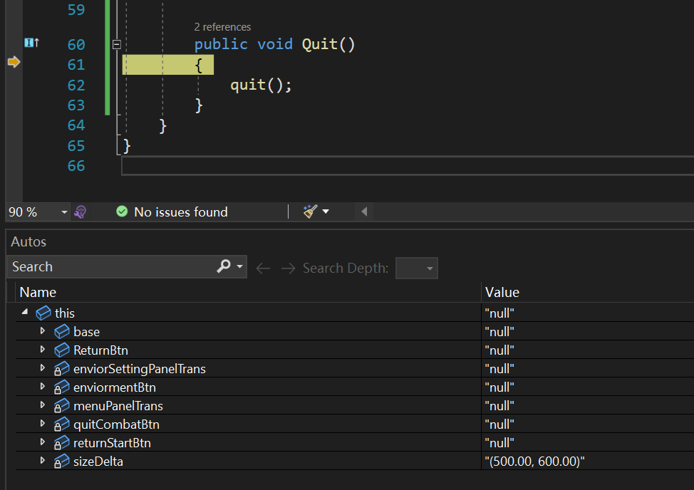

# UnityObject

指的是`UnityEngine.Object`, `MonoBehaviour`和`GameObject`都派生自这个类。 

通过这个类可以看出一些Unity对脚本生命周期的管理。
> 如`Instantiate`方法和`Destroy`方法

## 判断UnityObject是否被Destroy

以下简称为“判空”，这里的“判空”是指判断`UnityEngine.Object`是否执行了`Destroy`方法，而不是判断它有没有指向托管堆的一块内存（空引用）。

“判空”最好使用`x.Equals(null)`方法。也可以使用`x == null`方法，但要确保`x`的类型确实是一个`UnityEngine.Object`或其派生类的类型。如果`x`是一个接口类型（`IFoo x`, `interface IFoo{ }`），那么`x == null`执行的是`System.Object`类的引用判空方法:`System.Object.ReferenceEquals()`，不能判断被`Destroy`的物体是否为“空”。
> unity的`Destroy`不会真的释放被引用对象的内存空间，C#本身也做不到(?)。`UnityEngine.Object`重写`Equals`方法实现了对`Destroy`方法“判空”的支持，也重载了`operator ==`方法。但不像`System.Object`类的`Equals`方法，他是`virtual`的，而重载运算符只能以静态方法的方式实现（属于`equals`和`==`的讨论范围了。`equals`也有一个特点，它作为成员方法，对象为空的时候会报空引用异常，所以有时候可能需要两者一起使用）。

还要注意`Destroy`是下一帧生效的问题。

下面是一段调试时的代码，使用`(x被定义为一个接口类型)x == null`判断被`Destroy`的物体时产生的问题。

```cs
// 定义
public Stack<IOverlayUI> OverlayStack
internal interface IOverlayUI // 这个接口用于UI Monobehaviour实现退出方法
{
    public void Quit();
}
```


<center> 

这里的`this`指的是`OnEscMenu`中的局部变量`t`。 

</center>

<center> 

它进去了。。。 

</center>

根据上述讨论验证一下：

``` cs
var mb = (MonoBehaviour)t;
Debug.Log(t); // output "null"
Debug.Log(mb == null); // output true
Debug.Log(t == null); // output false
```

## 参考

- [Interface Object Never Equals Null - StackExchange](https://gamedev.stackexchange.com/questions/128971/interface-object-never-equals-null)
- [重要的类 Object - Unity Doc](https://docs.unity3d.com/cn/current/Manual/class-Object.html)
- [Object API - Unity Doc](https://docs.unity3d.com/cn/current/ScriptReference/Object.html)